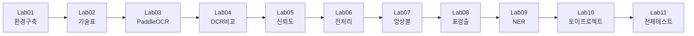

# Document AI 강의 자료 📚

[](https://colab.research.google.com/github/leecks1119/document_ai_lecture/blob/master/notebooks/Lab01_개발환경구축.ipynb)
[](https://www.python.org/downloads/)
[](https://opensource.org/licenses/MIT)

**8시간 실습 위주 Document AI 완전 정복 과정**

OCR, 이미지 전처리, NER, LLM 통합까지 실전 Document AI 기술을 Google Colab에서 바로 실습할 수 있습니다.

---

## 🚀 바로 시작하기

### 1️⃣ Colab에서 노트북 열기 (가장 쉬움!)

각 실습 노트북 상단의 **"Open in Colab"** 배지를 클릭하면 바로 실습 시작!

**또는 직접 URL로 접속:**
```
https://colab.research.google.com/github/leecks1119/document_ai_lecture/blob/master/notebooks/Lab01_개발환경구축.ipynb
```

### 2️⃣ 패키지 설치 (노트북 첫 셀)

모든 실습 코드가 포함된 패키지를 한 줄로 설치:

```python
!pip install -q git+https://github.com/leecks1119/document_ai_lecture.git
!apt-get install -y tesseract-ocr tesseract-ocr-kor
```

### 3️⃣ 바로 사용!

```python
from docai_course import OCRBenchmark, DocumentPreprocessor, UnifiedNERSystem

# OCR 비교
benchmark = OCRBenchmark()
results = benchmark.run_comparison('image.jpg', 'ground_truth')

# 이미지 전처리
preprocessor = DocumentPreprocessor()
processed, binary, metrics = preprocessor.adaptive_preprocessing_pipeline('image.jpg')

# 정보 추출
ner = UnifiedNERSystem()
entities = ner.rule_based_ner(text)
```

---

## 📚 실습 노트북 (11개)

| Lab | 제목 | Colab | 난이도 | 시간 |
|-----|------|-------|--------|------|
| **01** | [개발환경 구축](notebooks/Lab01_개발환경구축.ipynb) | [](https://colab.research.google.com/github/leecks1119/document_ai_lecture/blob/master/notebooks/Lab01_개발환경구축.ipynb) | ⭐ | 10분 |
| **02** | [Document AI 기술표](notebooks/Lab02_기술표.ipynb) | [](https://colab.research.google.com/github/leecks1119/document_ai_lecture/blob/master/notebooks/Lab02_기술표.ipynb) | ⭐ | 15분 |
| **03** | [PaddleOCR 기본](notebooks/Lab03_PaddleOCR.ipynb) | [](https://colab.research.google.com/github/leecks1119/document_ai_lecture/blob/master/notebooks/Lab03_PaddleOCR.ipynb) | ⭐⭐ | 20분 |
| **04** | [OCR 엔진 비교](notebooks/Lab04_OCR엔진비교.ipynb) | [](https://colab.research.google.com/github/leecks1119/document_ai_lecture/blob/master/notebooks/Lab04_OCR엔진비교.ipynb) | ⭐⭐⭐ | 30분 |
| **05** | [신뢰도 측정](notebooks/Lab05_신뢰도측정.ipynb) | [](https://colab.research.google.com/github/leecks1119/document_ai_lecture/blob/master/notebooks/Lab05_신뢰도측정.ipynb) | ⭐⭐⭐ | 25분 |
| **06** | [이미지 전처리](notebooks/Lab06_이미지전처리.ipynb) | [](https://colab.research.google.com/github/leecks1119/document_ai_lecture/blob/master/notebooks/Lab06_이미지전처리.ipynb) | ⭐⭐⭐⭐ | 40분 |
| **07** | [OCR 앙상블](notebooks/Lab07_앙상블.ipynb) | [](https://colab.research.google.com/github/leecks1119/document_ai_lecture/blob/master/notebooks/Lab07_앙상블.ipynb) | ⭐⭐⭐⭐ | 35분 |
| **08** | [표 검출](notebooks/Lab08_표검출.ipynb) | [](https://colab.research.google.com/github/leecks1119/document_ai_lecture/blob/master/notebooks/Lab08_표검출.ipynb) | ⭐⭐⭐⭐ | 40분 |
| **09** | [NER 정보추출](notebooks/Lab09_NER정보추출.ipynb) | [](https://colab.research.google.com/github/leecks1119/document_ai_lecture/blob/master/notebooks/Lab09_NER정보추출.ipynb) | ⭐⭐⭐ | 30분 |
| **10** | [토이 프로젝트](notebooks/Lab10_토이프로젝트.ipynb) | [](https://colab.research.google.com/github/leecks1119/document_ai_lecture/blob/master/notebooks/Lab10_토이프로젝트.ipynb) | ⭐⭐⭐⭐⭐ | 60분 |
| **11** | [전체 테스트](notebooks/Lab11_전체테스트.ipynb) | [](https://colab.research.google.com/github/leecks1119/document_ai_lecture/blob/master/notebooks/Lab11_전체테스트.ipynb) | ⭐⭐⭐⭐ | 40분 |

**총 실습 시간: 약 5시간 45분**

---

## 🎯 학습 경로



---

## 💡 Colab 사용 팁

### GPU 설정 (권장)
```
런타임 → 런타임 유형 변경 → 하드웨어 가속기: GPU 선택
```

### 실행 단축키
- `Shift + Enter`: 현재 셀 실행 후 다음 셀로
- `Ctrl + Enter`: 현재 셀만 실행

### Google Drive 마운트 (선택사항)
결과를 저장하고 싶으면:
```python
from google.colab import drive
drive.mount('/content/drive')

# 결과 저장 경로
SAVE_DIR = '/content/drive/MyDrive/DocumentAI_Results'
```

**언제 필요한가?**
- ✅ 여러 날에 걸쳐 작업할 때
- ✅ 결과를 보관하고 싶을 때
- ❌ 한 번에 끝나는 실습은 불필요

---

## 🎓 강의 커리큘럼

### 1부: 기초 (Lab01-03)
- Document AI 전체 기술 스택
- OCR 엔진별 특징 비교
- PaddleOCR 기본 사용법

### 2부: OCR 심화 (Lab04-05)
- 여러 OCR 엔진 성능 비교
- 신뢰도 측정 및 품질 관리

### 3부: 전처리 & 고급 (Lab06-08)
- 이미지 전처리로 정확도 향상
- 다중 OCR 앙상블 기법
- 표 검출 및 구조화

### 4부: 통합 & 실전 (Lab09-11)
- NER 기반 정보 추출
- 엔드투엔드 토이 프로젝트
- 전체 파이프라인 통합 테스트

---

## 📦 패키지 구조

```
document_ai_lecture/
├── notebooks/                 # 📓 실습 노트북 (11개)
│   ├── Lab01_개발환경구축.ipynb
│   ├── Lab02_기술표.ipynb
│   ├── ... (Lab03~10)
│   └── Lab11_전체테스트.ipynb
│
├── docai_course/             # 📦 Python 패키지
│   ├── ocr/                  # OCR 엔진
│   │   └── benchmark.py      # OCRBenchmark
│   ├── preprocessing/        # 전처리
│   │   └── preprocessor.py   # DocumentPreprocessor
│   ├── ner/                  # NER
│   │   └── unified_ner.py    # UnifiedNERSystem
│   └── hybrid/               # 하이브리드
│       └── system.py         # HybridDocumentAI
│
├── setup.py                  # 패키지 설정
├── requirements.txt          # 의존성
└── README.md                 # 이 파일
```

---

## 🔧 문제 해결

### Q1: 패키지 설치 오류
```python
!pip cache purge
!pip install --no-cache-dir git+https://github.com/leecks1119/document_ai_lecture.git
```

### Q2: GPU 메모리 부족
```
런타임 → 런타임 다시 시작
```

### Q3: 한글 깨짐
```python
!apt-get install -y fonts-nanum
import matplotlib.pyplot as plt
plt.rcParams['font.family'] = 'NanumGothic'
```

### Q4: Tesseract 한글 인식 안 됨
```python
!apt-get install -y tesseract-ocr-kor
```

---

## 👨‍🏫 강사 소개

**이찬희 프로 (Chanhee Lee Pro)**

- 삼성 SDS 보안 PM · AI-SOC 솔루션 업무 리딩
- Gen AI 및 보안 분석 전문가
- 24년 삼성SDS Gen AI 해커톤 본선 2회 참여

**전문 분야**
- Gen AI: LLM 기반 서비스 활용 및 개발
- 보안 분석: 위협 탐지, SIEM
- 클라우드: AWS 기반 아키텍처

---

## 📊 주요 기술 스택

### OCR 엔진
- **Tesseract**: 빠른 프로토타입
- **PaddleOCR**: 다국어 문서
- **EasyOCR**: 손글씨, 복잡한 레이아웃
- **Google Vision / AWS Textract / Upstage**: 상용 고정확도

### 전처리
- OpenCV: 노이즈 제거, 이진화, 기울기 보정
- PIL: 이미지 생성 및 기본 처리
- NumPy: 배열 연산

### 정보 추출
- 규칙 기반 (Regex)
- spaCy / Hugging Face
- LLM 기반 (GPT-4, Claude)

### 통합
- Python 3.8+
- PyTorch
- Pandas / Matplotlib

---

## 🤝 기여 및 문의

### 문제 보고
- **GitHub Issues**: https://github.com/leecks1119/document_ai_lecture/issues

### 기여 방법
1. Fork the repository
2. Create your feature branch
3. Commit your changes
4. Push to the branch
5. Create a Pull Request

---

## 📄 라이선스

MIT License - 자유롭게 사용, 수정, 배포 가능합니다.

---

## 🔗 관련 링크

- **Notion 강의 자료**: [Document AI 강의](https://www.notion.so/Document-AI-281707c7ae7581beb748feca63ac4e16)
- **GitHub Repository**: https://github.com/leecks1119/document_ai_lecture
- **Colab 빠른 시작**: [Lab01 열기](https://colab.research.google.com/github/leecks1119/document_ai_lecture/blob/master/notebooks/Lab01_개발환경구축.ipynb)

---

**Happy Learning! 🚀**

실무에 바로 적용 가능한 Document AI 기술을 마스터하세요!
