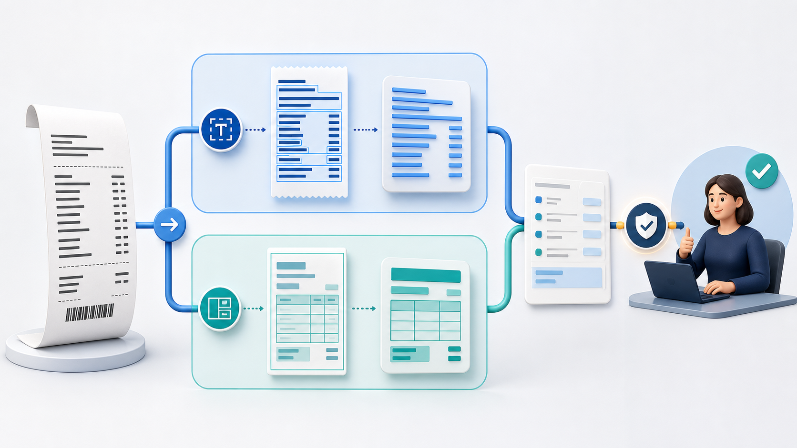

# Document AI와 생성형 AI를 활용한 문서 데이터 추출 실습

https://vivid-mailbox-751.notion.site/Document-AI-281707c7ae7581beb748feca63ac4e16

이 과정은 Python을 한 번쯤 사용해 본 실무자를 위한 하루 과정입니다. 문법을 외우는 대신, 한국 영수증 한 장을 직접 처리하면서 문서 자동화가 어떤 순서로 이루어지는지 경험합니다.



## 이 강의에서 얻어 갈 것

하루 수업이 끝났을 때 다음과 같은 생각이 들면 이 과정의 목표를 달성한 것입니다.

> “영수증으로 해보니 원리를 알겠다. 우리 회사의 견적서나 신청서도 이런 식으로 자동화해볼 수 있겠는데?”

수업에서는 개인정보를 가린 공개 한국 영수증을 사용합니다. 먼저 OCR로 글자와 위치를 읽고, 필요한 항목을 업무 데이터로 정리합니다. 그다음 원본과 결과를 비교하고, 오류를 수정한 뒤, 사람이 승인한 값만 Excel 파일로 저장합니다.

과정을 마치면 다음을 할 수 있습니다.

- OCR, 멀티모달 AI, VLM, Document AI의 차이를 설명할 수 있습니다.
- 문서 사진 한 장을 입력받아 필요한 값을 추출하는 작은 프로토타입을 만들 수 있습니다.
- 추출 결과가 맞는지 확인할 규칙과 사람의 검토 절차를 정할 수 있습니다.
- 견적서, 신청서, 거래명세서 가운데 첫 번째 PoC로 시험할 문서를 고를 수 있습니다.

## 하루 동안 완성하는 결과

수업의 중심은 하나의 영수증이 Excel 파일이 되기까지의 과정입니다.

```text
영수증 사진 한 장
  → 글자와 위치 읽기
  → 상호명·날짜·품목·합계 찾기
  → 업무에서 사용할 수 있는 JSON으로 정리
  → 계산과 원본 근거 확인
  → 잘못 읽은 값 수정
  → 사람 승인
  → Excel 다운로드
```

모든 필수 실습은 Google Colab에서 진행합니다. 코드를 처음부터 모두 작성하지 않아도 됩니다. 시작 코드와 짧은 빈칸이 제공되며, 막혔을 때 참고할 힌트와 완성 코드도 함께 볼 수 있습니다. 유료 API 키는 필요하지 않습니다.

제공 샘플로 한 번 성공한 뒤에는 내 사진이나 인터넷에서 내려받은 공개
문서 이미지 한 장으로 같은 실험을 반복할 수 있습니다. 2교시의
`실습 자료 고르기`에서 `내 컴퓨터에서 업로드` 또는 `인터넷 이미지 URL`을
선택하면 OCR 상자·인식 글자·신뢰도 표가 바로 표시됩니다. 내려받은
`ocr_result.json`은 3~7교시에 이어 쓸 수 있습니다. 모든 교시 마지막에는
자료 출처·잘된 점·실패한 점·다음 질문을 남기는 같은 형식의 실험 기록지가
있으며, 자료 선택과 개인정보 확인 방법은
[내 사진·공개 자료로 다시 실험하는 방법](docs/public_practice_sources.md)에
정리되어 있습니다.

각 코드 셀에는 초보자가 먼저 읽을 수 있는 `코드 읽기` 주석이 있습니다.
셀을 실행하면 출력의 맨 위에도 `현재 실습 단계`, `지금 할 일`,
`코드 읽는 법`, `확인할 결과`가 표시됩니다. `수정하지 않습니다`라고 적힌
셀은 그대로 실행하고, `TODO`가 있는 셀만 안내된 값 하나를 바꿉니다. 셀이
정상적으로 끝나면 `단계 실행 완료`와 다음 행동이 이어집니다. 따라서 코드
전체를 먼저 이해하려 하지 말고, 현재 단계에서 사용하는 변수·함수와 출력
결과 한 가지를 확인한 뒤 다음 셀로 이동합니다. 초록색 셀은 그대로 실행하고,
주황색 셀만 필수로 바꾸며, 파란색 선택 셀은 시간이 남을 때 실행합니다.
설치·환경설정·긴 앱 코드는 기본적으로 접혀 있으므로 처음에는 펼치지 않아도
됩니다.

## 8교시 학습 흐름

공지된 커리큘럼의 주제는 그대로 유지합니다. 각 교시는 앞 교시의 결과를 이어 받아 하나의 프로토타입을 완성하도록 구성되어 있습니다.

| 교시 | 주제 | 이번 시간에 이해할 핵심 | 직접 만드는 결과 |
| --- | --- | --- | --- |
| 1 | 한국 영수증으로 구분하는 OCR·VLM·Document AI | 같은 영수증의 OCR 결과, VLM 초안, 검증 결과를 비교하며 역할 차이를 확인합니다. | 기술 비교·오류 수정 보고서 |
| 2 | OCR 기반 텍스트 추출 실습 | OCR이 읽은 글자뿐 아니라 위치와 신뢰도도 함께 확인해야 합니다. | OCR 결과와 위치 표시 이미지 |
| 3 | 문서 구조 이해 및 추출 결과 정제 | 현재 이미지를 PP-OCRv5로 직접 읽고 흩어진 글자를 품목 행으로 다시 묶습니다. | 실제 OCR 행과 정리된 영수증 JSON |
| 4 | 멀티모달·생성형 AI 기반 핵심 정보 추출 | 공개 영수증을 PaddleOCR-VL-1.6-0.9B로 직접 읽고 OCR+규칙 결과와 비교합니다. | 실제 VLM 원본 결과·업무용 영수증 JSON |
| 5 | 문서 자동화 웹 애플리케이션 기본 구현 | 파일 한 장을 올리고 원본과 결과를 보는 최소 화면을 직접 엽니다. | Streamlit 미니 앱 |
| 6 | OCR 및 정보 추출 기능 연동 | 현재 이미지에 PP-OCRv5를 실제 실행하고 같은 함수를 앱 버튼에 연결합니다. | 실제 OCR 결과와 연결 앱 |
| 7 | 추출 결과 검증 및 데이터 저장 | 승인 전 저장을 막고 공개 원본 확인 뒤 Excel을 내려받습니다. | 검증 결과와 3시트 Excel |
| 8 | 실무 적용 시나리오 설계 및 최종 정리 | 견적서·신청서·거래명세서 사진에 실제 VLM을 실행해 확장 가능성을 판단합니다. | 실제 VLM 결과와 PoC 후보 카드 |

## 교재와 Colab 실습

교재를 먼저 읽고 같은 행의 Colab을 여는 순서로 진행합니다.

| 교시 | 교재 | 실습 |
| --- | --- | --- |
| 1 | [OCR·VLM·Document AI 이해하기](lessons/01_document_ai_overview.md) | [Colab 열기](https://colab.research.google.com/github/leecks1119/document_ai_lecture/blob/master/colab/01_document_ai_overview.ipynb) |
| 2 | [OCR로 영수증 읽기](lessons/02_ocr_basic.md) | [Colab 열기](https://colab.research.google.com/github/leecks1119/document_ai_lecture/blob/master/colab/02_ocr_basic.ipynb) |
| 3 | [읽힌 글자를 문서 구조로 정리하기](lessons/03_document_structure.md) | [Colab 열기](https://colab.research.google.com/github/leecks1119/document_ai_lecture/blob/master/colab/03_document_structure.ipynb) |
| 4 | [OCR·규칙과 실제 PaddleOCR-VL 비교하기](lessons/04_genai_extraction.md) | [Colab 열기](https://colab.research.google.com/github/leecks1119/document_ai_lecture/blob/master/colab/04_genai_extraction.ipynb) |
| 5 | [문서 자동화 화면 만들기](lessons/05_streamlit_basic.md) | [Colab 열기](https://colab.research.google.com/github/leecks1119/document_ai_lecture/blob/master/colab/05_streamlit_basic.ipynb) |
| 6 | [화면과 실제 문서 처리 연결하기](lessons/06_ocr_ai_integration.md) | [Colab 열기](https://colab.research.google.com/github/leecks1119/document_ai_lecture/blob/master/colab/06_ocr_ai_integration.ipynb) |
| 7 | [검증하고 Excel로 저장하기](lessons/07_validation_export.md) | [Colab 열기](https://colab.research.google.com/github/leecks1119/document_ai_lecture/blob/master/colab/07_validation_export.ipynb) |
| 8 | [우리 업무의 PoC 후보 고르기](lessons/08_business_application.md) | [Colab 열기](https://colab.research.google.com/github/leecks1119/document_ai_lecture/blob/master/colab/08_business_application.ipynb) |

Colab 링크는 배포 브랜치인 `master`의 실습 코드를 엽니다.

## 실습 전에 꼭 확인하세요

Google Colab은 인터넷을 통해 사용하는 외부 클라우드 환경입니다. 수업의 필수 실습은 저장소에 포함된 공개·합성 샘플로 진행합니다.

- 회사 문서나 개인정보가 포함된 문서를 승인 없이 업로드하지 않습니다.
- 자신의 영수증을 사용하고 싶다면 카드번호, 승인번호, 전화번호, 주소, 이름 등 식별 가능한 정보를 먼저 가립니다.
- AI가 만든 값은 원본과 비교하기 전까지 정답으로 취급하지 않습니다.
- 원본에서 찾을 수 없는 값은 추측해서 채우지 않습니다.
- 오류가 있거나 사람이 확인하지 않은 결과는 업무용 Excel로 저장하지 않습니다.
- 수업이 끝나면 Colab 런타임의 파일을 삭제하고 런타임을 종료합니다.

## 실습이 잘되지 않을 때

처음 모델을 내려받는 과정에서는 시간이 걸릴 수 있습니다. 실행이 3분 이상 진행되지 않거나 네트워크 오류가 발생하면 해당 교시의 준비된 예제 결과를 사용해 다음 단계로 넘어갈 수 있습니다. 준비된 결과를 사용했다는 사실은 화면에 표시되므로 실제 모델 실행 결과와 혼동하지 않습니다.

코드가 막혔을 때는 다음 순서로 확인합니다.

1. 현재 셀보다 위에 있는 셀을 빠뜨리지 않았는지 확인합니다.
2. 오류 메시지를 지우지 말고 첫 번째 오류가 발생한 셀을 찾습니다.
3. 빈칸 아래의 힌트를 확인합니다.
4. 그래도 해결되지 않으면 완성 코드를 실행해 실습 결과를 복구합니다.

자세한 해결 방법은 [수강생 실습 환경](docs/environment.md)과 [수강생 문제 해결](docs/troubleshooting.md)에서 확인할 수 있습니다.

## 다른 문서 형식도 체험합니다

마지막 교시에는 영수증에서 익힌 원리를 다른 업무 문서와 파일 형식에 적용해 봅니다.

- [견적서 Excel](sample_docs/formats/quotation.xlsx): 셀, 수식, 병합 셀 확인
- [이미지 기반 신청서 Word](sample_docs/formats/application_form.docx): 문서 안에 들어 있는 이미지 확인
- [거래명세서 PDF](sample_docs/formats/transaction_statement.pdf): 선택 가능한 텍스트와 스캔 이미지의 차이 확인
- [표 캡처 PowerPoint](sample_docs/formats/table_summary.pptx): 도형의 읽기 순서와 표 캡처의 한계 확인

사진으로 촬영한 형태의 교육용 합성 문서도 함께 사용합니다.

- [견적서 사진](sample_docs/extensions/quotation_photo.png)
- [신청서 사진](sample_docs/extensions/application_form_photo.png)
- [거래명세서 사진](sample_docs/extensions/transaction_statement_photo.png)

## 참고자료

기술 내용은 2026년 7월 27일을 조사 기준일로 삼았습니다. 공식 문서, 표준, 규제기관 자료를 중심으로 교차 확인했으며, 교시별 출처와 적용 범위는 [과정 참고자료](docs/course_references.md)에 정리되어 있습니다.

강의 운영과 복구 절차, 평가 기준처럼 강사에게만 필요한 자료는 `instructor` 폴더에 별도로 보관합니다.
