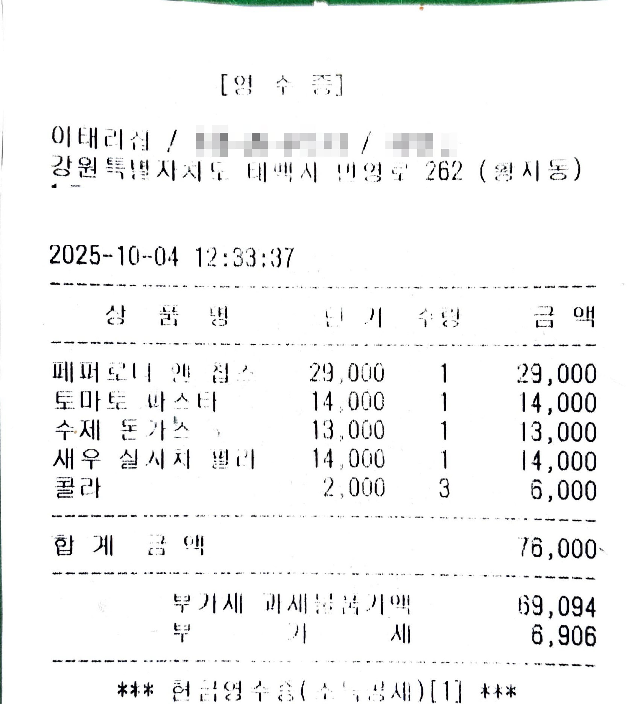
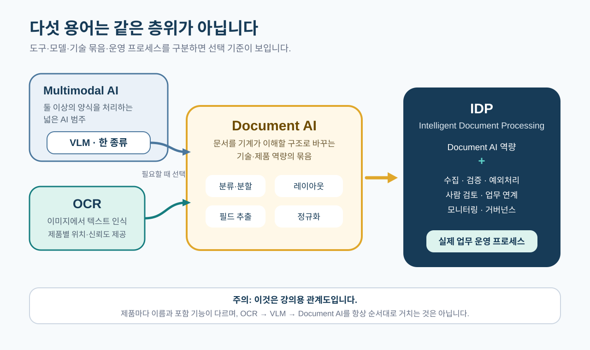
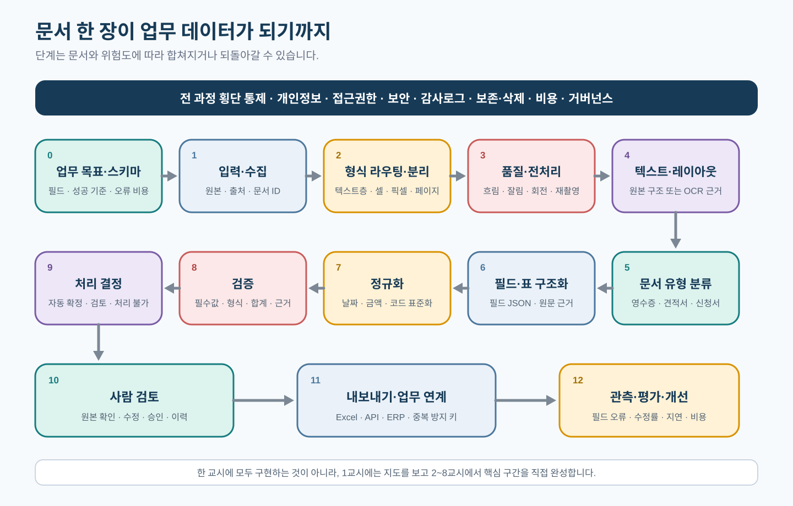
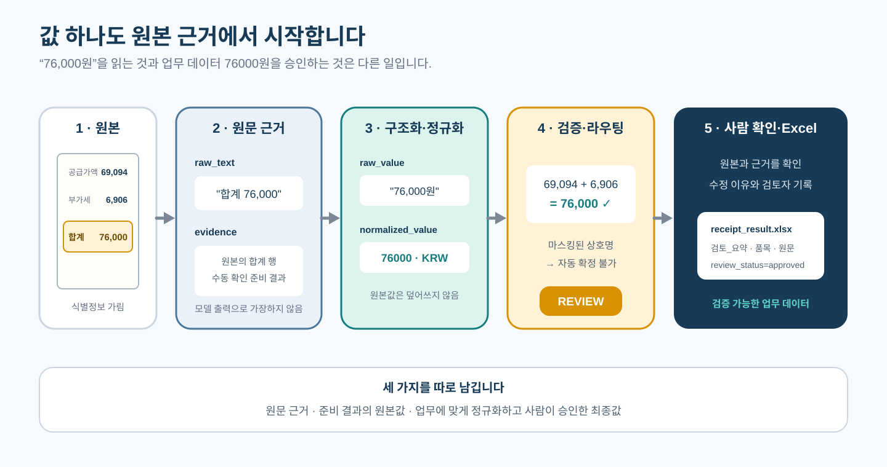

# 1교시. 한국 영수증으로 구분하는 OCR·VLM·Document AI

> 영수증 한 장이 글자 인식에서 끝나지 않고, 근거를 확인할 수 있는 업무 데이터가 되는 전체 과정을 먼저 경험합니다.
>
> **핵심 메시지:** OCR·VLM은 문서를 읽고 구조화할 때 선택하거나 조합하는 기술이며, 실제 자동화에는 목표 정의부터 검증·사람 확인·업무 연결·운영 개선까지 필요합니다.

[](https://colab.research.google.com/github/leecks1119/document_ai_lecture/blob/document_ai_lecture_2026/colab/01_document_ai_overview.ipynb)

## 1. 학습 목표

- OCR·Multimodal AI·VLM·Document AI·IDP를 이 과정의 기준으로 구분해 설명할 수 있다.
- 문서 자동화의 0~12 전체 지도에서 각 단계의 입력·출력·확인 대상을 찾을 수 있다.
- 실제 영수증의 원문·정규화 값·근거·검증·처리 결정을 연결할 수 있다.

## 2. 이번 교시의 결과물

- `receipt_pipeline_trace.json`: 영수증 한 장이 전체 과정에서 어떻게 바뀌는지 기록한 추적 파일

완성된 `receipt_result.xlsx`의 모습을 먼저 확인합니다. 검증과 사람 확인을 적용해 직접 Excel을 만드는 실습은 7교시에서 진행합니다.

## 3. 시작하기 전에

### 선수 지식

- Python 딕셔너리의 `"이름": 값` 모양을 읽을 수 있으면 충분하다.
- 코드를 처음부터 작성하지 않는다. 빈칸, 힌트, 전체 정답을 모두 제공한다.

### 준비 파일

- [식별정보를 가린 한국 실물 영수증](../sample_docs/public_receipts/korea/taebaek_restaurant_2025_redacted.png)
- [1교시 Colab 노트북](../colab/01_document_ai_overview.ipynb)
- 준비된 `receipt_result.xlsx` 미리보기



이 자료는 2025-10-04 발행된 실제 한국 영수증을 식별정보가 보이지 않도록 가린 교육용 샘플입니다. [Wikimedia Commons 원본](https://commons.wikimedia.org/wiki/File:Receipt_taebaek_restaurant_IMG_2614_modified.jpg)은 Public Domain(`PD-ineligible`)으로 표시돼 있습니다.

이번 시간에는 OCR·VLM 모델을 설치하지 않습니다. 원본과 대조해 둔 **준비 결과**로 값이 이동하는 경로를 추적합니다. 실제 OCR은 2교시에서 실행합니다.

## 4. 핵심 개념

용어의 경계는 산업 표준 하나로 완전히 통일돼 있지 않고 공급자에 따라 일부 겹친다. 아래는 이 과정에서 일관되게 사용할 구분이다.

### 4.1 OCR은 이미지에서 텍스트를 인식하는 기술이다

OCR(Optical Character Recognition)은 사진·스캔처럼 픽셀로 된 문서에서 글자를 찾고 문자로 바꾼다.

```text
문서 이미지
  → 글자가 있는 영역 찾기
  → 영역의 문자 인식
  → 인식 텍스트
```

많은 OCR 시스템은 페이지, 좌표, 인식 신뢰도 같은 메타데이터도 함께 제공할 수 있다. 그러나 이것은 모든 OCR의 필수 출력은 아니다.

```text
가능한 출력: "부가세 6,906", 페이지 1, 좌표, 신뢰도
보장하지 않음: 6,906원이 실제 세액인지, 합계가 맞는지, 저장해도 되는지
```

OCR의 신뢰도는 정답 확률이나 업무 승인 점수가 아니다. 원본 대조와 업무 규칙 검증은 별도로 필요하다.

### 4.2 Multimodal AI는 상위 범주이고 VLM은 그중 한 종류다

Multimodal AI는 이미지·텍스트·음성처럼 둘 이상의 데이터 형식을 함께 다루는 AI의 넓은 범주다. VLM(Vision-Language Model)은 그중 이미지와 언어를 함께 다루는 모델이다.

```text
Multimodal AI
└── VLM: 이미지 + 지시문 → 설명·질의응답·표·초안 JSON 등
```

문서용 VLM은 영수증 이미지와 “상호명·날짜·합계를 JSON으로 정리해 줘”라는 지시를 함께 받아 구조 초안을 만들 수 있다. 모델에 따라 문자 인식, 표·레이아웃 해석, 질문 응답을 한 번에 시도할 수도 있다.

VLM이 만든 값은 빨리 확인할 수 있는 **초안**이다. 흐린 숫자를 그럴듯하게 추측하거나, 표의 행을 잘못 연결하거나, 원문에 없는 값을 만들 수 있다. 따라서 원문 근거·스키마·계산 규칙·사람 확인 없이 확정하지 않는다.

### 4.3 Document AI 역량과 IDP 운영 범위를 구분한다

이 과정에서 **Document AI**는 문서를 기계가 사용할 수 있는 구조로 바꾸는 기술·제품 역량의 묶음으로 정의한다.

- 텍스트와 레이아웃 인식
- 문서 유형 분류
- 키-값과 표 추출
- 업무 스키마에 맞춘 구조화와 정규화

**IDP(Intelligent Document Processing)**는 Document AI 역량을 실제 업무 운영에 연결한 더 넓은 범위로 구분한다.

- 문서 접수와 접근 통제
- 검증과 예외 분기
- 사람 검토와 승인·반려
- Excel·업무 시스템 연결
- 모니터링, 평가, 개선, 보존과 삭제

Document AI와 IDP는 시장에서 같은 뜻처럼 쓰이기도 한다. 이 구분은 “모델 실행”과 “업무에서 안전하게 계속 쓰는 과정”을 놓치지 않기 위한 **강의상의 기준**이다.

> **쉬운 비유**
>
> OCR은 영수증을 받아 적는 역할, VLM은 이미지와 요청을 함께 보고 표 초안을 만드는 역할, Document AI는 문서를 구조화하는 도구 상자, IDP는 접수·검사·승인·전달·사후관리까지 정한 비용 처리 운영이다.

비유의 한계: 각 기술은 사람처럼 완전하게 이해하지 않으며, 실제 제품은 여러 기능을 한 번에 제공할 수 있다. 따라서 `OCR → VLM → Document AI`를 반드시 거치는 고정 순서로 이해하면 안 된다.



## 5. 전체 실습 흐름

아래 0~12는 외워야 할 새 용어 13개가 아니라, 하루 동안 계속 돌아올 **전체 참조 지도**입니다. 문서 종류와 제품에 따라 일부 단계는 합쳐지거나 순서가 달라질 수 있습니다.



| 단계 | 하는 일 | 영수증 한 장에서 확인할 것 | 다음으로 넘기는 결과 |
| ---: | --- | --- | --- |
| 0 | 업무 목표·성공 기준·스키마 정의 | 무엇을 왜 자동화하며 오류 영향은 무엇인가? | 필드·검증·성공 기준 |
| 1 | 접수 | 사진·PDF·Office 원본을 어디서 받는가? | 원본과 문서 ID |
| 2 | 형식 라우팅·분리 | 텍스트층, 셀 구조, 사진 중 무엇인가? 한 장인가? | 처리 경로 |
| 3 | 품질 확인·전처리 | 흐림·잘림·회전·해상도가 처리 가능한가? | 처리 가능 이미지 또는 반려 |
| 4 | 텍스트·레이아웃 추출 | 원본 구조 파서인가, OCR인가? | 원문·페이지·위치 등 |
| 5 | 문서 유형 분류 | 영수증인가, 견적서인가? | 문서 유형 |
| 6 | 필드·표 구조화 | 상호명·날짜·품목·합계의 후보는 무엇인가? | 스키마 초안 |
| 7 | 정규화 | `"76,000원"`을 `76000`으로 바꿔도 원문이 남는가? | 원문과 정규화 값 |
| 8 | 검증 | 필수값·형식·`69,094 + 6,906 = 76,000`이 맞는가? | 규칙별 통과·실패 |
| 9 | 처리 결정 | 자동 확정, 사람 검토, 처리 불가 중 무엇인가? | `AUTO_ACCEPT`·`REVIEW`·`REJECT` |
| 10 | 사람 검토 | 담당자가 원본 근거를 보고 승인·수정·반려했는가? | 사람의 결정과 기록 |
| 11 | 내보내기·업무 연결 | 승인된 값을 Excel·업무 시스템에 어떻게 전달하는가? | 사용 가능한 업무 데이터 |
| 12 | 결과 확인·개선 | 어떤 문서·필드에서 자주 틀리는가? | 오류 기록과 다음 개선 항목 |

보안·개인정보·접근 통제·감사 기록·보존·삭제 정책은 특정 한 단계가 아니라 **0~12 전체를 가로지른다.**

처리 결정의 최소 기준은 다음과 같다.

| 결정 | 예시 기준 | 다음 행동 |
| --- | --- | --- |
| `AUTO_ACCEPT` | 필수값·형식·합계·원문 근거 규칙을 모두 통과하고 오류 영향이 낮음 | 승인된 저장 경로로 전달 |
| `REVIEW` | 값은 있으나 모호하거나 정책상 사람 확인이 필요함 | 원본과 후보 값을 검토자에게 표시 |
| `REJECT` | 입력 품질이 부족하거나 필수 근거가 없거나 지원하지 않는 문서임 | 재촬영·재접수·수동 처리 |

사람 검토에서는 원본과 추출 후보를 비교해 승인·수정·반려하고 그 이유를 남깁니다. 원문에 없는 근거를 새로 만들지 않습니다.

## 6. 단계별 실습

### 실습 1. 영수증 한 장의 처리 흔적 완성하기

먼저 완성 Excel의 두 시트와 원본 영수증을 비교합니다. 그다음 Colab에서 준비된 추적 데이터의 빈칸 세 곳을 직접 채웁니다.



```python
TRACE = {
    "schema_fields": ["net_amount", "tax_amount", "total_amount"],
    "raw_text": "공급가액 69,094 / 부가세 6,906 / 합계 76,000",
    "fields": {
        "net_amount": {
            "raw_value": "69,094",
            "normalized_value": 69094,
            "evidence": "원본의 공급가액 행",
        },
        "tax_amount": {
            "raw_value": "6,906",
            "normalized_value": 6906,
            "evidence": "원본의 부가세 행",
        },
        "total_amount": {
            "raw_value": "76,000",
            "normalized_value": 76000,
            "evidence": "원본의 합계 행",
        },
    },
}

TRACE["validation"] = {
    "amount_math_ok": 69094 + 6906 == 76000,
    "evidence_present": all(
        field["evidence"] for field in TRACE["fields"].values()
    ),
}
TRACE["routing_decision"] = "REVIEW"  # 정책상 사람 확인 필수
TRACE["human_decision"] = "APPROVED_AFTER_SOURCE_CHECK"
TRACE["next_step"] = "7교시에서 receipt_result.xlsx 생성"
```

`TRACE`는 원본과 대조해 둔 **교육용 준비 결과**입니다. 실제 OCR·VLM 실행 결과가 아니므로 준비 결과 표시를 그대로 유지합니다.

```python
import json

with open("receipt_pipeline_trace.json", "w", encoding="utf-8") as file:
    json.dump(TRACE, file, ensure_ascii=False, indent=2)
```

**기대 결과**

- `raw_value`와 `normalized_value`가 모두 남아 있다.
- `69,094 + 6,906 = 76,000` 검증 결과가 `True`다.
- 합계가 맞아도 정책에 따라 `REVIEW`가 될 수 있다.
- Colab 파일 영역에 `receipt_pipeline_trace.json`이 생긴다.

**완성 복구본**

이미지 표시나 빈칸 실행이 막히면 노트북의 비식별 축소 이미지와 완성 `PREPARED_TRACE`를 사용합니다. 준비 결과를 실제 OCR·VLM 출력이라고 표시하지 않습니다.

## 7. 실습 결과 확인

- `schema_fields`, `raw_text`, `raw_value`, `normalized_value`, `evidence`가 있는가?
- 검증 결과와 처리 결정이 분리돼 있는가?
- `REVIEW` 뒤 사람의 결정과 다음 단계가 기록됐는가?
- 준비 결과를 실제 모델 실행 결과라고 표시하지 않았는가?

## 8. 문제 해결

| 증상 | 원인 | 해결 방법 |
| --- | --- | --- |
| 이미지가 보이지 않음 | 셀 실행 순서 문제 | 이미지 준비 셀부터 다시 실행 |
| `JSONDecodeError` | 따옴표·쉼표 오류 | 전체 정답과 해당 줄 비교 |
| 합계가 `False` | 문자열을 더했거나 값 오타 | 정규화 값 세 개가 정수인지 확인 |
| 합계가 맞는데 `REVIEW` | 검증과 업무 정책은 별개 | 정책상 사람 확인 사유를 기록 |
| 단계가 너무 많아 보임 | 전체 지도를 암기하려 함 | 오늘은 각 단계의 입력·출력 위치만 표시 |

## 9. 형성평가

1. VLM은 Multimodal AI와 별개의 상위 기술인가?
2. 이 과정에서 Document AI와 IDP를 어떻게 구분하는가?
3. 합계 계산이 맞아도 `REVIEW`가 될 수 있는 이유는 무엇인가?

<details>
<summary>정답 보기</summary>

1. 아니다. VLM은 이미지와 언어를 다루는 Multimodal AI의 한 종류다.
2. Document AI는 문서를 구조화하는 기술·제품 역량, IDP는 이를 접수·검증·사람 확인·업무 연결·운영 개선과 결합한 범위로 구분한다. 다만 시장에서는 두 용어가 겹쳐 쓰일 수 있다.
3. 필수 근거가 모호하거나 오류 영향이 크거나 조직 정책이 사람 확인을 요구할 수 있기 때문이다.

</details>

## 10. 핵심 요약

- OCR은 이미지에서 텍스트를 인식하고, 제품에 따라 위치·신뢰도 등도 제공할 수 있다.
- VLM은 Multimodal AI의 한 종류이며 문서 구조 초안을 만들 수 있지만 사실성을 보장하지 않는다.
- Document AI는 구조화 역량, IDP는 이를 실제 업무 운영에 연결한 범위로 구분한다.
- 실제 자동화는 목표 정의부터 검증·예외·사람 확인·연결·평가까지 이어진다.
- 검증 통과와 업무 승인은 같은 말이 아니다.

## 11. 완료 체크리스트

- [ ] 다섯 용어를 이 과정의 기준으로 구분했다.
- [ ] 0~12 지도에서 영수증 데이터의 이동을 표시했다.
- [ ] 원문·정규화 값·근거·검증·처리 결정을 구분했다.
- [ ] `receipt_pipeline_trace.json`을 만들었다.

## 12. 다음 교시 예고

2교시에서는 식별정보를 가린 영수증 한 장에 PP-OCRv5 Korean을 실행하고, 실제 OCR 결과를 원본과 대조한다.

## 참고 자료

- [Google Cloud Document AI 개요](https://cloud.google.com/document-ai/docs/overview)
- [Google Cloud Document 응답 구조](https://docs.cloud.google.com/document-ai/docs/handle-response)
- [AWS Intelligent Document Processing 설명](https://aws.amazon.com/what-is/intelligent-document-processing/)
- [NIST AI RMF Core](https://airc.nist.gov/airmf-resources/airmf/5-sec-core/)
- [Google Cloud Document AI 평가](https://docs.cloud.google.com/document-ai/docs/evaluate)
- [PaddleOCR PP-OCRv5 다국어 모델](https://www.paddleocr.ai/latest/en/version3.x/algorithm/PP-OCRv5/PP-OCRv5_multi_languages.html)
- [PaddleOCR-VL 1.6](https://www.paddleocr.ai/main/en/version3.x/algorithm/PaddleOCR-VL/PaddleOCR-VL-1.6.html)

전체 출처와 교시별 적용 범위는 [과정 참고자료](../docs/course_references.md)에서 확인할 수 있습니다.
