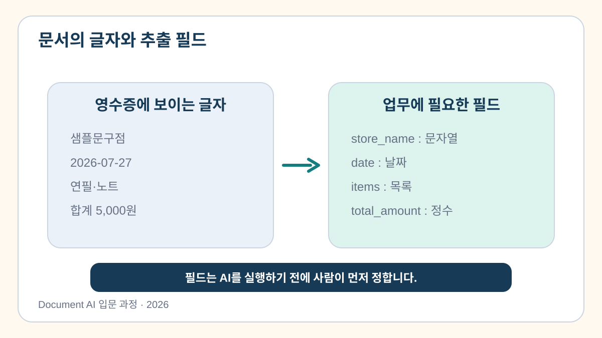

# 1교시. OCR보다 먼저 정할 것

> 합성 영수증에서 필요한 값을 고르고 Document AI 전체 흐름을 한 문장으로 설명합니다.

[](https://colab.research.google.com/github/leecks1119/document_ai_lecture/blob/document_ai_lecture_2026/colab/01_document_ai_overview.ipynb)

## 1. 학습 목표

- OCR·VLM·Document AI의 차이를 설명할 수 있다.
- 영수증에서 추출할 필드와 자료형을 정할 수 있다.
- 오류 영향이 큰 필드에 사람 검토가 필요함을 표시할 수 있다.

## 2. 이번 교시의 결과물

- `field_spec.json`: 상호명·날짜·품목·합계의 추출 기준표

## 3. 시작하기 전에

### 선수 지식

- Python 딕셔너리와 문자열을 본 적이 있으면 충분하다.

### 준비 파일

- [합성 영수증](../sample_docs/receipt_sample.png)
- [1교시 Colab 노트북](../colab/01_document_ai_overview.ipynb)

샘플은 교육용 합성 문서이며 실제 개인정보가 없다.

## 4. 핵심 개념

### 4.1 OCR과 VLM은 서로 다른 읽기 도구다

OCR은 이미지 속 글자와 위치를 읽는 데 강하다. VLM은 이미지와 언어를 함께 보며 제목·표 같은 관계를 표현한다. Document AI는 알맞은 도구로 읽은 뒤 필요한 값 찾기, JSON 변환, 검증, 저장까지 이어지는 전체 흐름이다.

> **쉬운 비유**
> OCR은 글자를 받아 적는 직원, VLM은 문서의 배치도 함께 보는 직원, Document AI는 결과를 검토·저장하는 전체 업무 절차다.

비유의 한계: 실제 시스템은 사람처럼 문서를 완전히 이해하지 않는다. 학습된 패턴과 작성한 규칙으로 값을 예측하고 검사한다.


### 4.2 필드를 먼저 정한다

자동화는 문서를 AI에 넣는 일보다 **어떤 값을 왜 꺼낼지 정하는 일**에서 시작한다.

| 필드 | 의미 | 자료형 | 필수 | 사람 검토 |
| --- | --- | --- | --- | --- |
| `store_name` | 상호명 | 문자열 | 예 | 아니요 |
| `date` | 거래일자 | 날짜 문자열 | 예 | 예 |
| `items` | 품목 목록 | 배열 | 예 | 예 |
| `total_amount` | 총액 | 정수 | 예 | 예 |



### 4.3 틀렸을 때의 영향을 생각한다

상호명의 글자 하나가 틀린 것과 총액이 틀린 것은 업무 영향이 다르다. 금액·날짜처럼 영향이 큰 값은 자동 처리 후에도 사람이 원문과 비교하도록 설계한다.

## 5. 전체 실습 흐름

```text
합성 영수증 관찰
  → 필요한 필드 4개 선택
  → 자료형·필수 여부 작성
  → 사람 검토 여부 표시
  → field_spec.json 저장
```

## 6. 단계별 실습

### 실습 1. 추출 기준표 확인하기

Colab에 제공된 네 필드의 자료형·필수 여부·사람 검토 여부를 확인하고, 업무 영향이 다르다고 판단하면 값을 수정한다.

```python
FIELD_SPEC = {
    "store_name": {"type": "string", "required": True, "human_review": False},
    "date": {"type": "string", "required": True, "human_review": True},
    "items": {"type": "array", "required": True, "human_review": True},
    "total_amount": {
        "type": "integer",
        "required": True,
        "human_review": True,
    },
}
```

```python
import json

with open("field_spec.json", "w", encoding="utf-8") as file:
    json.dump(FIELD_SPEC, file, ensure_ascii=False, indent=2)
```

**기대 결과**

- 네 필드의 이름·자료형·검토 여부가 출력된다.
- Colab 파일 영역에 `field_spec.json`이 생긴다.

**mock 대체 경로**

다음 텍스트를 보고 같은 실습을 진행한다.

```text
샘플문구점 / 2026-07-27
연필 2개 2,000원 / 노트 1개 3,000원 / 합계 5,000원
```

## 7. Codex 활용

### 요청 목표

필드 정의가 너무 복잡하지 않은지 검토한다.

### 실습 프롬프트

```text
목표: 초보자용 영수증 추출 필드 정의를 검토해줘.
맥락: 8시간 Document AI 입문 과정의 첫 실습이야.
제약조건: 상호명, 날짜, 품목, 총액 네 필드만 사용해.
완료 기준: 자료형과 사람 검토 여부가 어색한 부분만 짧게 알려줘.
```

### 생성 결과 확인

- 요청하지 않은 필드가 추가되지 않았는가?
- 총액과 날짜에 사람 검토가 표시됐는가?

## 8. 문제 해결

| 증상 | 원인 | 해결 방법 |
| --- | --- | --- |
| `SyntaxError` | 쉼표나 따옴표 누락 | 바로 윗줄의 닫는 괄호와 쉼표 확인 |
| 파일이 보이지 않음 | 셀을 아직 실행하지 않음 | 저장 셀 실행 후 Colab 파일 목록 새로고침 |

## 9. 형성평가

1. OCR·VLM과 Document AI의 가장 큰 차이는 무엇인가?
2. 추출 필드를 AI 실행 전에 정해야 하는 이유는 무엇인가?

<details>
<summary>정답 보기</summary>

1. OCR과 VLM은 문서를 읽는 도구이고 Document AI는 도구 선택부터 구조화·검증·활용까지 포함한다.
2. 필요한 값과 성공 기준이 있어야 자동화가 끝났는지 판단할 수 있기 때문이다.

</details>

## 10. 핵심 요약

- OCR과 VLM은 문서에 맞게 고르는 Document AI의 읽기 도구다.
- 필드명·자료형·필수 여부를 먼저 정한다.
- 오류 영향이 큰 값에는 사람 검토를 연결한다.

## 11. 완료 체크리스트

- [ ] OCR·VLM과 Document AI의 차이를 설명할 수 있다.
- [ ] 네 개의 추출 필드를 정의했다.
- [ ] `field_spec.json`을 만들었다.

## 12. 다음 교시 예고

2교시에서는 정의한 필드의 값을 얻기 전에 OCR 결과의 텍스트·위치·신뢰도를 읽는다.

## 참고 자료

- [Google Cloud Document AI 개요](https://docs.cloud.google.com/document-ai/docs/overview)
- [Amazon Textract 개요](https://docs.aws.amazon.com/textract/latest/dg/what-is.html)
- [Azure AI Document Intelligence 개요](https://learn.microsoft.com/en-us/azure/ai-services/document-intelligence/overview?view=doc-intel-4.0.0)
