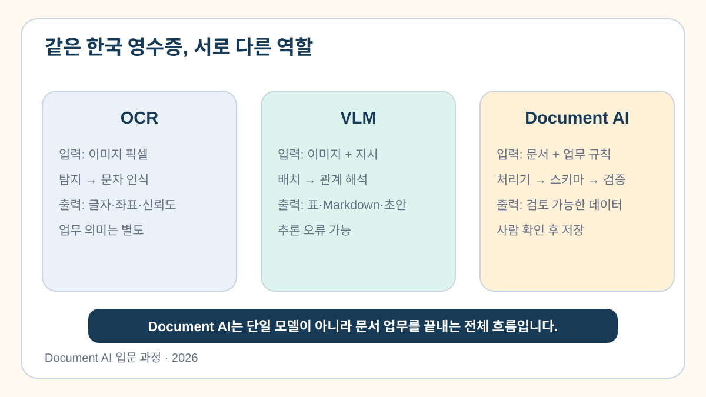

# 1교시. 한국 영수증으로 구분하는 OCR·VLM·Document AI

> 같은 영수증도 OCR은 글자를 읽고, VLM은 배치와 관계를 해석하며, Document AI는 검증과 사람 확인까지 연결합니다.

[](https://colab.research.google.com/github/leecks1119/document_ai_lecture/blob/document_ai_lecture_2026/colab/01_document_ai_overview.ipynb)

## 1. 학습 목표

- OCR·VLM·Document AI의 정의를 구분할 수 있다.
- 세 방식의 입력·처리 과정·출력 차이를 설명할 수 있다.
- 준비된 예시와 실제 모델 실행 결과를 구별할 수 있다.

## 2. 이번 교시의 결과물

- `technology_comparison.json`: 세 기술의 역할과 처리 과정 비교표

## 3. 시작하기 전에

### 선수 지식

- Python 딕셔너리와 리스트를 본 적이 있으면 충분하다.

### 준비 파일

- [식별정보를 가린 한국 실물 영수증](../sample_docs/public_receipts/korea/taebaek_restaurant_2025_redacted.png)
- [1교시 Colab 노트북](../colab/01_document_ai_overview.ipynb)


이 자료는 2025-10-04 발행된 실제 한국 영수증이다. [Wikimedia Commons 원본](https://commons.wikimedia.org/wiki/File:Receipt_taebaek_restaurant_IMG_2614_modified.jpg)은 Public Domain(`PD-ineligible`)으로 표시돼 있다. 수업용 PNG는 전화번호·거래 식별 영역을 추가로 가리고 메타데이터를 제거했다.

## 4. 핵심 개념

### 4.1 OCR은 글자를 읽는다

**정의:** OCR(광학 문자 인식)은 이미지 픽셀에서 글자 영역을 찾고 문자를 인식하는 기술이다.

```text
픽셀 → 텍스트 영역 탐지 → 문자 인식 → 텍스트·좌표·신뢰도
```

OCR은 `합계`, `76,000` 같은 글자를 읽을 수 있다. 하지만 둘이 업무상 총액이라는 의미인지, 금액이 맞는지는 별도 검사다.

### 4.2 VLM은 이미지 속 관계를 해석한다

**정의:** VLM(시각 언어 모델)은 이미지와 지시문을 함께 받아 글자·배치·주변 관계를 언어로 표현하는 모델이다.

```text
이미지 + 지시 → 시각·배치와 언어 관계 해석 → 표·Markdown·답변·초안 JSON
```

VLM은 품목명과 오른쪽 금액의 관계를 표로 정리하기 좋다. 다만 흐린 값을 추측하거나 행을 잘못 연결할 수 있으므로 결과가 곧 사실은 아니다.

### 4.3 Document AI는 업무가 끝나도록 연결한다

**정의:** Document AI는 단일 모델 이름이 아니라 문서를 검토 가능한 업무 데이터로 바꾸는 **시스템과 업무 흐름**이다.

```text
입력 품질 → OCR·VLM·혼합 선택 → 업무 스키마
→ 규칙 검증 → 사람 확인 → 저장
```

예를 들어 `69,094 + 6,906 = 76,000`인지 검사하고, 흐린 품목은 담당자에게 보낸 뒤 승인된 값만 저장한다.

> **쉬운 비유**
> OCR은 영수증을 받아 적는 사람, VLM은 품목과 금액 관계를 표로 정리하는 사람, Document AI는 검사·승인·저장까지 정한 전체 비용 처리 절차다.

비유의 한계: 실제 AI는 사람처럼 의미를 완전히 이해하지 않는다. OCR과 VLM은 모두 틀릴 수 있고, Document AI도 스키마·규칙·사람 확인이 있어야 한다.



## 5. 전체 실습 흐름

```text
한국 실물 영수증 관찰
  → 교육용 OCR·VLM 예시 비교
  → 세 기술의 입력·과정·출력·한계 정리
  → technology_comparison.json 저장
```

## 6. 단계별 실습

### 실습 1. 같은 영수증의 세 가지 처리 방식 비교하기

아래 값은 **교육용 예시이며 실제 모델 실행 결과가 아니다.** 각 기술이 하는 일과 보장하지 못하는 일을 확인한다.

```python
COMPARISONS = [
    {
        "technology": "OCR",
        "input": "영수증 이미지 픽셀",
        "process": ["텍스트 영역 탐지", "문자 인식"],
        "output": "교육용 예시: 텍스트·좌표·신뢰도",
        "cannot_guarantee": "업무 의미와 금액의 정확성",
    },
    {
        "technology": "VLM",
        "input": "영수증 이미지와 추출 지시",
        "process": ["시각·배치 확인", "언어 관계 해석"],
        "output": "교육용 예시: 표·Markdown·초안 JSON",
        "cannot_guarantee": "관계와 값의 사실성",
    },
    {
        "technology": "Document AI",
        "input": "영수증과 업무 규칙",
        "process": ["처리기 선택", "스키마", "검증", "사람 확인"],
        "output": "검토 가능한 업무 데이터",
        "cannot_guarantee": "검토 없는 완전 자동 정확성",
    },
]
```

```python
import json

result = {
    "input_document": "taebaek_restaurant_2025_redacted.png",
    "example_label": "교육용 예시 — 실제 모델 실행 결과가 아님",
    "comparisons": COMPARISONS,
    "document_ai_workflow": [
        "입력 품질", "OCR·VLM·혼합", "업무 스키마",
        "규칙 검증", "사람 확인", "저장",
    ],
}
with open("technology_comparison.json", "w", encoding="utf-8") as file:
    json.dump(result, file, ensure_ascii=False, indent=2)
```

**기대 결과**

- `comparisons`에 OCR·VLM·Document AI가 한 번씩 들어 있다.
- Colab 파일 영역에 `technology_comparison.json`이 생긴다.

**mock 대체 경로**

이미지 표시가 실패해도 노트북에 내장된 축소 이미지와 위 교육용 예시로 같은 실습을 진행한다. mock을 실제 업로드 처리 결과라고 말하지 않는다.

## 7. Codex 활용

### 실습 프롬프트

```text
목표: OCR, VLM, Document AI 비교표를 초보자 관점에서 검토해줘.
맥락: 같은 한국 영수증 한 장을 비교한 1교시 결과야.
제약조건: 기술을 추가하지 말고 입력·과정·출력·한계만 확인해.
완료 기준: 서로 역할이 섞인 항목만 짧게 알려줘.
```

## 8. 문제 해결

| 증상 | 원인 | 해결 방법 |
| --- | --- | --- |
| 이미지가 보이지 않음 | 셀 실행 순서 문제 | 이미지 준비 셀부터 다시 실행 |
| `JSONDecodeError` | 따옴표·쉼표 오류 | 완성 예시와 해당 줄 비교 |
| 결과를 실제 추론으로 오해 | 예시 라벨 누락 | `example_label`을 삭제하지 않음 |

## 9. 형성평가

1. OCR이 `76,000`을 읽으면 그 금액을 바로 확정해도 되는가?
2. Document AI는 OCR이나 VLM과 같은 단일 모델 이름인가?

<details>
<summary>정답 보기</summary>

1. 아니다. 원문·합계 규칙·업무 기준과 사람 확인이 필요하다.
2. 아니다. 처리기 선택부터 스키마·검증·사람 확인·저장까지의 시스템과 흐름이다.

</details>

## 10. 핵심 요약

- OCR은 이미지에서 글자·위치·신뢰도를 만든다.
- VLM은 이미지와 지시를 함께 보고 배치·관계를 구조 초안으로 표현한다.
- Document AI는 읽기부터 검증·사람 확인·저장까지 연결한다.

## 11. 완료 체크리스트

- [ ] 세 기술의 정의와 과정을 설명할 수 있다.
- [ ] 교육용 예시와 실제 모델 결과를 구분했다.
- [ ] `technology_comparison.json`을 만들었다.

## 12. 다음 교시 예고

2교시에서는 OCR 결과의 텍스트·위치·신뢰도를 직접 확인한다.

## 참고 자료

- [PaddleOCR 3.x OCR 파이프라인](https://www.paddleocr.ai/main/en/version3.x/pipeline_usage/OCR.html)
- [PaddleOCR-VL 파이프라인](https://www.paddleocr.ai/latest/en/version3.x/pipeline_usage/PaddleOCR-VL.html)
