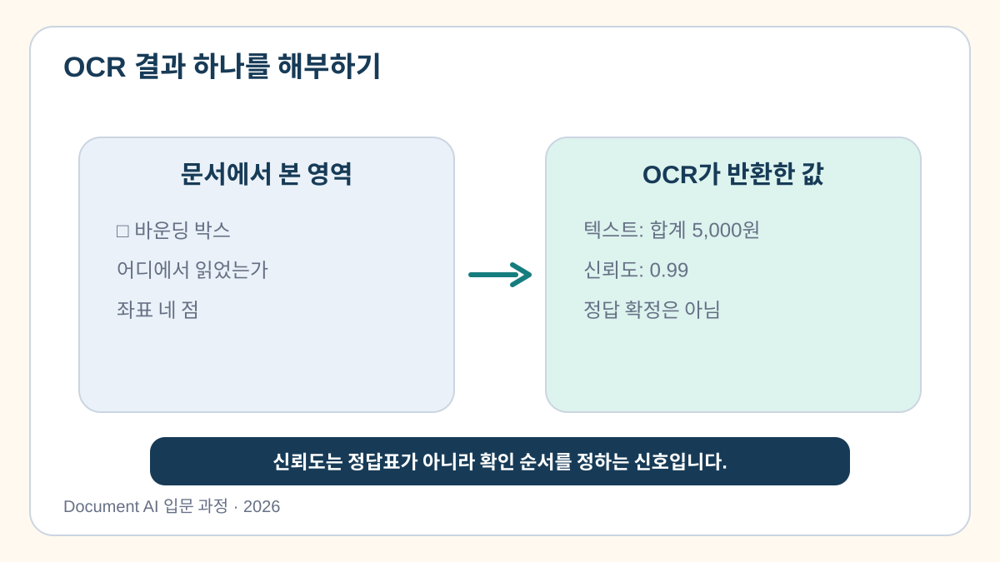
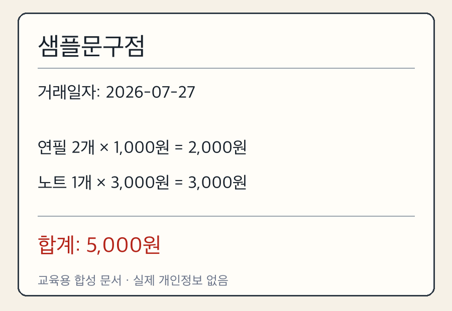
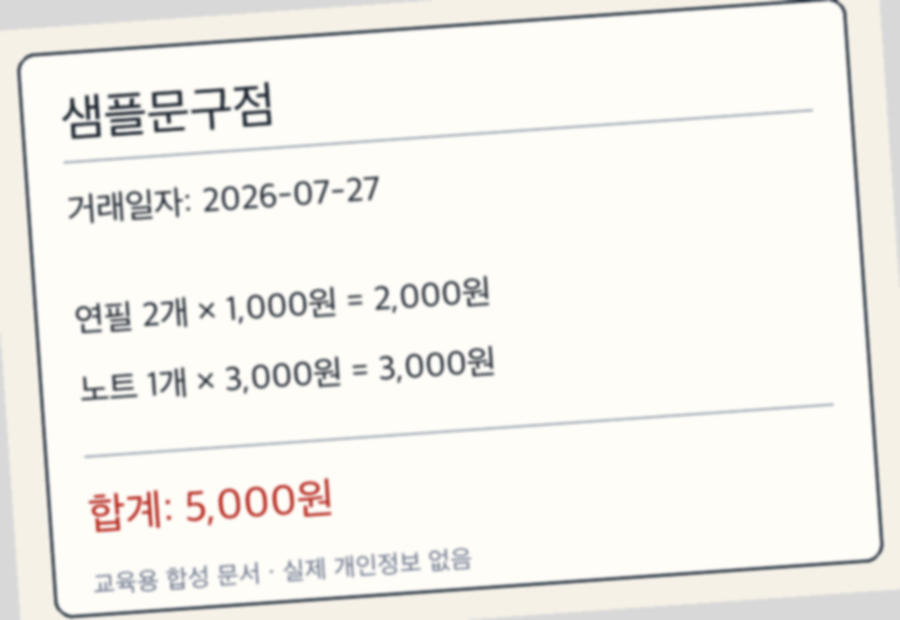
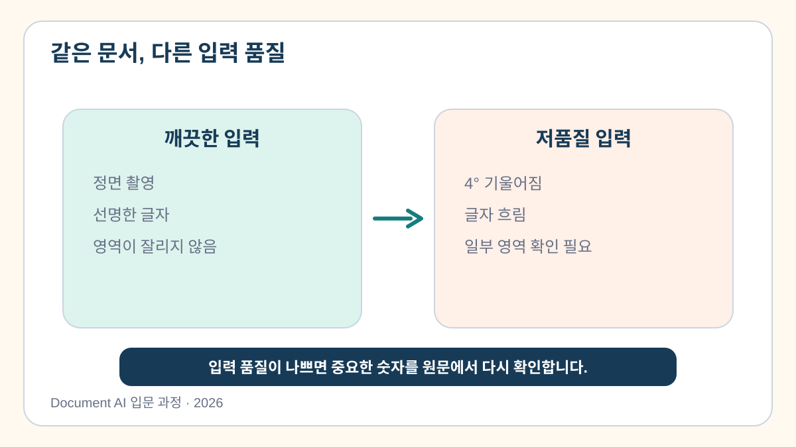

# 2교시. OCR 기반 텍스트 추출 실습

사람은 영수증을 보는 순간 상호명, 날짜, 품목, 합계를 구분합니다. OCR은 먼저 이미지에서 글자 조각을 찾고, 각 글자가 무엇인지 판독합니다. 이번 시간에는 OCR 결과를 직접 만들어 보고, 모델이 잘 읽은 부분과 놓친 부분을 원본에서 확인합니다.

> **이번 시간의 도착점:** OCR이 반환한 글자·위치·신뢰도를 함께 읽고, 중요한 값은 원본과 대조해야 하는 이유를 설명합니다.

[2교시 Colab 실습 열기](https://colab.research.google.com/github/leecks1119/document_ai_lecture/blob/master/colab/02_ocr_basic.ipynb)

## 실습 문서와 개인정보

기본 실습은 개인정보를 가린 공개 한국 영수증으로 진행합니다.


자신의 점심 영수증이나 사진첩의 영수증도 선택 실습에 사용할 수 있습니다. 다만 Google Colab은 외부 클라우드이므로 회사 정책을 먼저 확인해야 합니다. 카드번호, 승인번호, 사업자번호, 전화번호, 주소, 이름처럼 개인이나 거래를 식별할 수 있는 정보는 업로드하기 전에 완전히 가립니다.

## OCR 결과를 읽는 세 가지 열쇠

OCR 결과를 볼 때는 텍스트만 확인하지 않습니다.

| 결과 | 의미 | 확인할 질문 |
| --- | --- | --- |
| 텍스트 | 모델이 읽은 문자열 | 글자가 원본과 같은가? |
| 위치 | 문자열이 있던 이미지 영역 | 올바른 줄과 항목을 가리키는가? |
| 신뢰도 | 모델이 판독 결과를 얼마나 확신하는지 나타내는 신호 | 중요한 값은 원본과 다시 확인했는가? |



신뢰도가 높다는 이유만으로 결과를 승인해서는 안 됩니다. 예를 들어 `76,000`을 `16,000`으로 읽었는데 모델의 신뢰도가 높게 나올 수도 있습니다. 금액과 날짜처럼 업무에 영향을 주는 값은 반드시 원본과 비교합니다.

## 이번 실습에서 사용하는 OCR

`PaddleOCR`은 여러 OCR 모델을 실행하는 도구 이름이고, `PP-OCRv5
Korean`은 이번 영수증을 읽는 한국어 인식 모델 이름입니다.

- 실행 도구: `PaddleOCR 3.7.0`
- 언어 설정: `lang="korean"`
- 인식 모델: `ocr_version="PP-OCRv5"`

PaddleOCR는 실행 도구이고 PP-OCRv5는 선택한 OCR 모델 계열입니다. 이
실습은 한국어 문서를 위해 `lang="korean"`과 `ocr_version="PP-OCRv5"`를
명시합니다. “PaddleOCR를 쓴다”와 “PP-OCRv5 Korean 모델을 쓴다”는 서로
다른 수준의 설명입니다.

모델 이름을 외울 필요는 없습니다. 중요한 것은 다음 두 가지입니다.

- “PaddleOCR을 사용했다”는 설명만으로는 실행한 언어 모델과 버전을 알 수 없습니다.
- 결과를 비교하거나 다시 실행하려면 사용한 언어와 모델 버전을 기록해야 합니다.

## 이미지 품질이 결과에 미치는 영향

같은 내용의 문서라도 촬영 상태에 따라 OCR 결과가 달라집니다.







글자가 작거나 흐리면 숫자의 모양이 비슷해지고, 문서가 기울면 같은 줄의 글자가 서로 다른 높이에서 검출될 수 있습니다. 그래서 모델을 바꾸기 전에 먼저 이미지의 해상도, 초점, 기울기, 그림자를 확인하는 것이 좋습니다.

## 직접 해보기

### 1. 공개 영수증을 불러옵니다

Colab의 셀을 위에서부터 차례대로 실행합니다. 처음 실행할 때는 라이브러리와 한국어 모델을 내려받기 때문에 시간이 걸릴 수 있습니다.

노트북은 기본적으로 영수증 이미지에 OCR을 실제로 실행합니다. 성공하면 화면에
`결과 출처: 지금 선택한 사진을 직접 읽었습니다.`라고 표시됩니다. 즉, 미리
저장해 둔 답을 보여 준 것이 아니라 현재 Colab에서 모델을 실행했다는 뜻입니다.

제공 샘플로 먼저 끝까지 성공한 뒤에는 입력 준비 셀의
`실습 자료 고르기`를 엽니다. `내 컴퓨터에서 업로드`를 고르면 휴대폰 사진이나
내려받은 공개 JPG·JPEG·PNG·WEBP 파일 한 장을 선택할 수 있습니다.
`인터넷 이미지 URL`을 고르면 이미지 자체 주소를 붙여 넣을 수 있습니다.
인터넷 자료의 이용조건과 내 문서의 개인정보 확인 방법은
[내 사진·공개 자료로 다시 실험하는 방법](../docs/public_practice_sources.md)을
따릅니다.

### 2. OCR 결과를 원본 위에 표시합니다

실행이 끝나면 글자 주변에 사각형이 표시된 이미지와 인식 글자·신뢰도 표가
Colab 화면에 바로 나타나고 `ocr_boxes.png`도 만들어집니다. 다음 세 곳을
원본과 비교해 보세요.

1. 상호명이 있는 위쪽 영역
2. 거래 날짜와 시간이 있는 영역
3. 합계 금액이 있는 아래쪽 영역

텍스트가 맞더라도 사각형이 다른 줄을 가리킨다면 값과 원본 근거가 잘못 연결될 수 있습니다.

상자를 올바르게 그리려면 OCR 좌표가 어느 크기의 이미지에서 만들어졌는지
알아야 합니다. 현재 파일을 직접 읽었을 때는 현재 이미지 크기를 사용하고,
이전 실제 실행 기록을 사용할 때는 함께 저장한 좌표 메타데이터를 사용합니다.
가로세로 비율이 맞지 않으면 상자를 그리지 않고 오류로 처리합니다.

### 3. 잘 읽힌 곳과 다시 볼 곳을 표시합니다

노트북의 짧은 빈칸에 원본과 대조할 키워드 세 가지를 적습니다. 공개 정답은
상호명 영역의 `이태리`, 날짜 영역의 `2025`, 합계 영역의 `76,000`입니다.
세 키워드가 서로 다른 세 판독 영역을 표시하는지 확인합니다.

OCR 결과는 다음과 같은 형태로 저장됩니다.

```json
{
  "text": "합계 금액 76,000",
  "confidence": 0.96,
  "matches_source": null,
  "review_note": ""
}
```

`matches_source`가 아직 `null`인 것은 사람이 원본과 대조하지 않았다는 뜻입니다. 원본을 확인한 뒤 맞았는지 표시하고, 틀렸다면 `review_note`에 무엇이 달랐는지 적습니다.

### 4. 결과를 내려받습니다

실습이 끝나면 다음 두 파일을 확인합니다.

- `ocr_result.json`: 판독 문자열, 위치, 신뢰도, 검토 상태
- `ocr_boxes.png`: 검출 위치를 영수증 위에 표시한 이미지

두 파일은 `lesson02_ocr_outputs.zip` 하나로 내려받습니다. 이 ZIP은 다음 교시에서 다시 사용합니다.

## 실제 실행이 어려울 때

모델 설치나 다운로드가 3분 이상 진행되지 않으면 실행을 중지하고 수업용 예제
결과로 계속할 수 있습니다. 이때 화면에는 다음 문장이 표시됩니다.

> 수업용 예제 결과를 불러왔습니다. 현재 사진을 분석한 결과가 아닙니다.

이 경우 글자·위치·신뢰도는 같은 공개 영수증을 이전에 실제로 읽어 보존한
기록입니다. 현재 업로드한 파일의 결과가 아니므로 화면에는
`결과 출처: 제공 예제의 OCR 결과를 사용합니다.`라고 표시되고, 결과 JSON의
`result_source`에도 `제공 예제 사용`이라고 기록됩니다.

오류 메시지는 지우지 마세요. 어떤 단계에서 문제가 생겼는지 확인하는 것도 문서 자동화 실습의 일부입니다.

## 결과를 해석해 봅시다

실습을 마친 뒤 다음 질문에 답해 보세요.

1. 신뢰도가 가장 높은 문자열은 무엇이었나요?
2. 신뢰도가 높지만 원본 확인이 꼭 필요한 항목은 무엇인가요?
3. 사각형의 위치가 잘못되면 다음 단계에서 어떤 문제가 생길까요?
4. 선명한 이미지와 흐린 이미지의 결과는 어떻게 달랐나요?

이번 시간의 핵심은 OCR 결과를 정답으로 받아들이는 것이 아니라, **글자·위치·신뢰도를 원본과 함께 읽는 것**입니다.

다음 교시에는 OCR이 읽은 글자 조각을 상호명, 날짜, 품목, 합계 구조로 다시 정리합니다.

## 참고자료

PaddleOCR 모델과 OCR 결과 해석에 관한 공식 근거는 [과정 참고자료의 2교시 항목](../docs/course_references.md)에서 확인할 수 있습니다.
