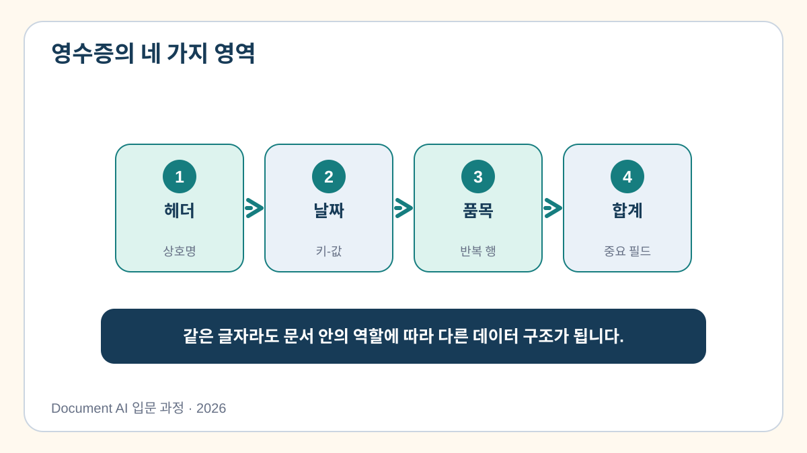
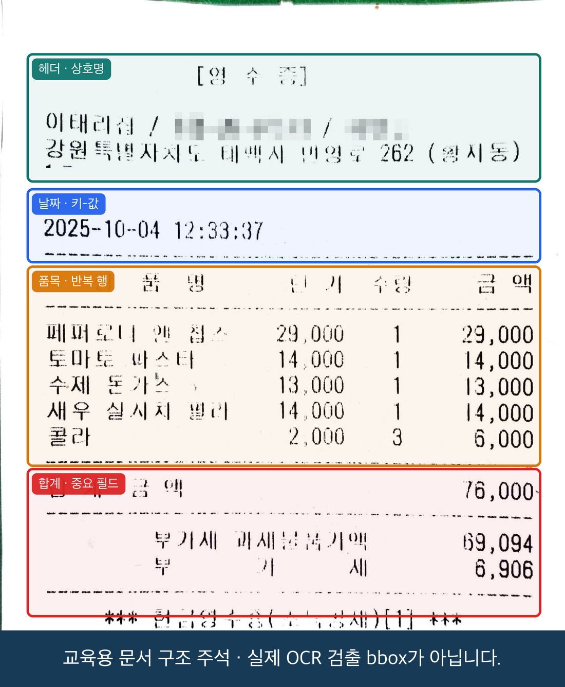
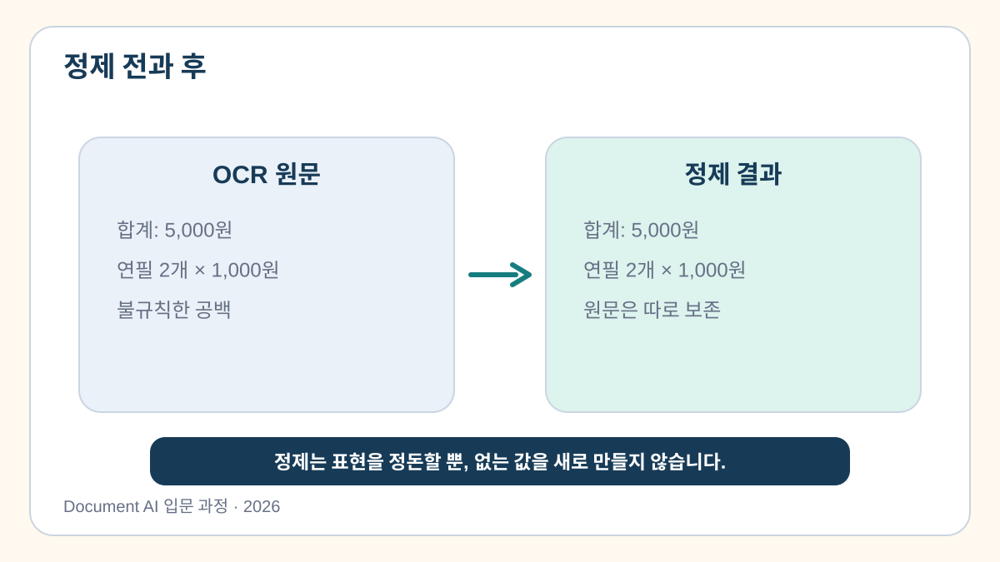

# 3교시. 문서 구조 이해 및 추출 결과 정제

OCR이 영수증의 글자를 모두 읽었다고 해서 곧바로 품목 표를 만들 수 있는 것은 아닙니다. 모델이 `콜라`, `2,000`, `3`, `6,000`을 각각 정확히 읽었더라도 네 값이 같은 품목 행이라는 관계를 알아야 하기 때문입니다.

이번 시간에는 흩어진 OCR 결과를 사람이 읽는 순서로 정리하고, 상호명·날짜·품목·합계 구조로 묶어 봅니다.

[3교시 Colab 실습 열기](https://colab.research.google.com/github/leecks1119/document_ai_lecture/blob/document_ai_lecture_2026/colab/03_document_structure.ipynb)

## 글자를 읽는 것과 문서를 이해하는 것은 다릅니다

영수증에는 여러 종류의 관계가 함께 들어 있습니다.

- `거래일시 → 2025-10-04`처럼 이름과 값이 짝을 이루는 **키-값**
- `품목명 → 단가 → 수량 → 금액`이 여러 번 반복되는 **품목 행**
- 여러 품목을 하나의 금액으로 요약하는 **합계**





위 그림의 색상 상자는 문서 구조를 설명하기 위해 사람이 표시한 영역입니다. 실제 OCR이 검출한 사각형과는 다릅니다.

## 위치를 이용해 읽기 순서를 복원합니다

OCR이 반환하는 글자 조각의 순서는 사람이 위에서 아래로 읽는 순서와 다를 수 있습니다. 일반적인 영수증에서는 다음과 같이 정리할 수 있습니다.

1. 사각형의 세로 위치가 비슷한 글자들을 같은 줄로 묶습니다.
2. 같은 줄 안에서는 가로 위치를 기준으로 왼쪽에서 오른쪽으로 정렬합니다.
3. 정리된 한 줄이 상호명, 날짜, 품목, 합계 중 어디에 해당하는지 분류합니다.

이때 세로 위치가 정확히 같지 않다는 점에 주의해야 합니다. 촬영된 문서가 기울어졌거나 글자 크기가 다르면 같은 줄의 사각형도 조금씩 위아래로 어긋납니다. 그래서 “완전히 같은 높이”가 아니라 “충분히 가까운 높이”인지 판단하는 기준이 필요합니다.

> OCR 결과는 장바구니에 섞여 들어온 물건과 비슷합니다. 정제는 물건을 종류와 용도에 따라 다시 정리하는 일입니다. 장바구니에 없던 물건을 새로 넣는 일은 아닙니다.

## 원문과 정제 결과를 함께 보관하는 이유

정제 과정에서는 불필요한 공백을 줄이거나 금액 표기를 통일할 수 있습니다.



```text
원문: 합계   금액 76,000
정제: 합계 금액 76,000
```

정제된 문장만 저장하면 나중에 무엇이 바뀌었는지 확인하기 어렵습니다. 따라서 원문과 정제문, 변경 내용을 함께 남깁니다.

```json
{
  "raw_text": "합계   금액 76,000",
  "cleaned_text": "합계 금액 76,000",
  "change": "연속된 공백을 하나로 정리"
}
```

## 직접 해보기

### 1. 2교시 결과를 불러옵니다

새 Colab 창을 열었다면 2교시에서 내려받은 ZIP을 풀고 `ocr_result.json`을 선택합니다. 같은 Colab 런타임을 계속 사용하고 있다면 파일을 자동으로 찾습니다.

이전 결과가 없을 때는 노트북에 포함된 검수 예제로 실습할 수 있습니다. 준비된 예제를 사용하더라도 이후의 정제 과정은 동일합니다.

### 2. 원문을 보존한 채 공백을 정리합니다

정제 함수를 실행하고 `before`와 `after`를 비교합니다. 다음 항목을 확인하세요.

- 글자 자체가 바뀌지 않았는가?
- 여러 개의 공백만 정리되었는가?
- 원문이 별도의 항목에 그대로 남아 있는가?

### 3. 영수증을 네 영역으로 나눕니다

정리된 각 줄을 다음 영역 가운데 하나로 분류합니다.

| 영역 | 들어갈 내용 |
| --- | --- |
| 머리말 | 상호명과 문서 제목 |
| 거래일시 | 날짜와 시간 |
| 품목 | 품목명, 단가, 수량, 금액이 반복되는 줄 |
| 합계 | 공급가액, 세액, 최종 결제 금액 |

아직 분류하기 어려운 줄은 억지로 끼워 넣지 않고 `other`에 남깁니다. 모르는 값을 모른다고 표시하는 것이 잘못된 필드에 넣는 것보다 안전합니다.

### 4. 품목 행의 공통 모양을 찾아봅니다

이번 영수증의 품목 줄은 대체로 문장 끝에 `단가·수량·금액` 숫자가 이어집니다. 노트북의 빈칸에 이 특징을 찾는 정규식을 완성합니다.

정규식을 처음 보는 경우에는 “줄의 끝부분에 숫자 세 묶음이 차례로 있는가?”라는 질문을 코드로 표현한다고 이해하면 됩니다. 먼저 직접 작성해 보고, 막히면 힌트와 완성 코드를 비교하세요.

### 5. 정리된 결과를 확인합니다

실습이 끝나면 `course_outputs/clean_receipt.json`이 만들어집니다. 파일에서 다음 내용을 확인합니다.

- OCR 원문이 그대로 남아 있습니다.
- 공백을 정리한 줄이 원문과 구분되어 있습니다.
- 품목 다섯 줄이 반복 행 후보로 묶였습니다.
- 분류하지 못한 줄은 `other`에 남아 있습니다.

이 파일은 다음 교시에서 업무용 JSON을 만드는 입력으로 사용합니다.

## 표 캡처에도 같은 문제가 생깁니다

Excel 표를 화면 캡처하면 셀, 행, 열 정보는 사라지고 픽셀만 남습니다. OCR로 글자를 모두 읽어도 어떤 품목명과 어떤 금액이 같은 행인지 다시 찾아야 합니다. 표 캡처 자동화에서 글자 인식률만큼 구조 복원이 중요한 이유입니다.

## 이번 시간의 정리

- OCR 결과의 순서는 사람이 읽는 순서와 다를 수 있습니다.
- 글자의 위치를 이용하면 같은 줄과 읽기 순서를 복원할 수 있습니다.
- 원문은 수정하지 않고 정제 결과와 함께 보관합니다.
- 분류하기 어려운 값은 추측하지 않고 검토 대상으로 남깁니다.
- 문서 구조를 복원해야 품목과 금액의 관계를 보존할 수 있습니다.

다음 교시에는 정리한 영수증에서 상호명, 날짜, 품목, 합계를 추출해 업무에서 사용할 수 있는 JSON을 만듭니다. 같은 문서를 VLM으로 처리하는 방법과도 비교합니다.

## 참고자료

레이아웃 분석과 구조화에 관한 공식 근거는 [과정 참고자료의 3교시 항목](../docs/course_references.md)에서 확인할 수 있습니다.
