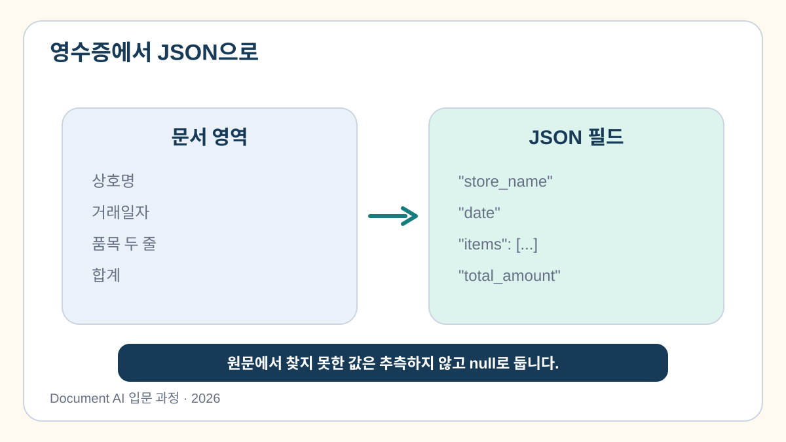
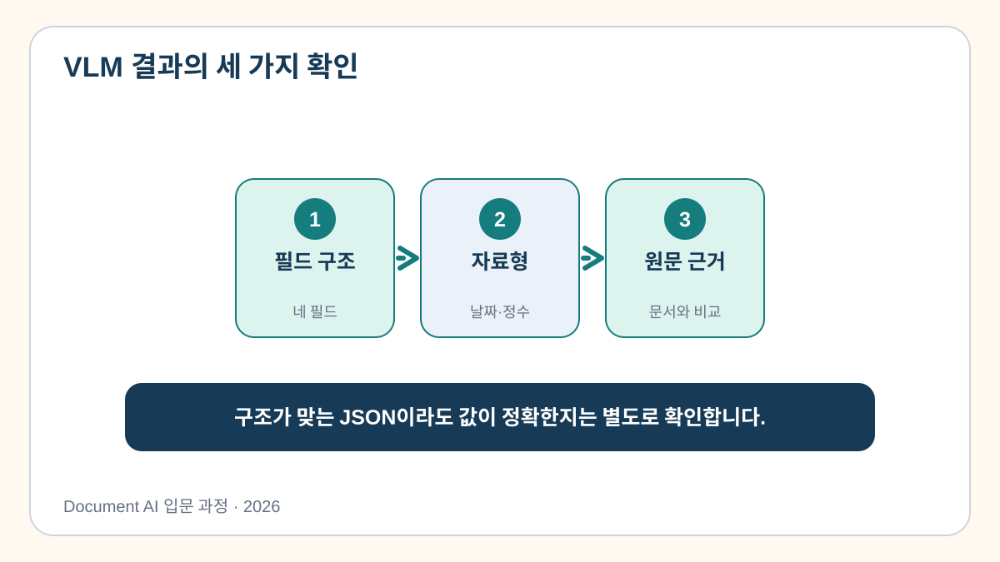

# 4교시. 멀티모달·생성형 AI 기반 핵심 정보 추출

> **이번 교시의 한 문장:** OCR+규칙과 VLM은 서로 다른 초안 경로이며, 어느 쪽도 원본 근거와 검증 전에는 확정 데이터가 아닙니다.

[Colab 실습 열기](https://colab.research.google.com/github/leecks1119/document_ai_lecture/blob/document_ai_lecture_2026/colab/04_genai_extraction.ipynb)

## 60분 뒤 남길 것

- 3교시 OCR 정제 결과를 규칙으로 업무 JSON으로 변환합니다.
- 상호명·날짜·총액에 `raw_value`와 근거를 붙입니다.
- 같은 공개 영수증의 준비된 VLM 구조 예시와 결과 모양을 비교합니다.
- `course_outputs/receipt.json`과 `vlm_comparison.json`을 만듭니다.

## 개념 10%: 두 추출 경로와 세 검사 질문

```text
OCR+규칙: 이미지 → 글자·좌표 → 공간 순서 복원 → 정규식·파서 → JSON
VLM: 이미지+지시문 → 문맥을 반영한 구조 초안 → JSON
공통: 스키마·원본 근거·업무 규칙 → 사람 검토
```

4교시 필수 코드는 첫 번째 경로입니다. 정제 텍스트에 규칙을 적용한 결과를 VLM 실행이라고 부르지 않습니다. 두 번째 경로는 강사 시연 1회와 명시적으로 표시된 준비 구조 예시로 비교합니다.

1. **스키마**: 필드와 자료형이 맞는가?
2. **근거**: 이 값이 원본 어디에서 왔는가?
3. **불확실성**: 근거가 없을 때 `null`인가?

VLM은 이미지와 문맥을 함께 보므로 표나 제목을 빠르게 구조화할 수 있습니다. 그러나 자연스러운 거짓값을 만들 수 있으므로 JSON 모양이 맞는 것과 내용이 맞는 것은 별개의 문제입니다.

> 쉬운 비유: VLM은 문서를 읽고 표 초안을 만드는 신입 사원입니다. 보기 좋은 표를 만들었어도 원본과 맞는지는 검토해야 합니다.





## 실습 90%

### 1. 이전 정제 결과를 우선 읽습니다

새 Colab 런타임이면 3교시에 내려받은 `clean_receipt.json`을 업로드합니다.

```text
PREVIOUS_LESSON: clean_receipt.json 사용
PREPARED_FALLBACK: 독립 실행용 검수 텍스트 사용
```

### 2. OCR+규칙 기준선을 만듭니다

3교시의 `clean_receipt.json`에서 정규식과 파서로 상호명·날짜·품목·총액을 찾습니다. 이 결과의 `source_mode`는 `ocr_rule_extraction_from_previous_lesson`입니다. 준비 입력으로 독립 실행했더라도 추출 방식은 OCR 텍스트+규칙입니다.

### 3. 준비된 VLM 구조 예시와 비교합니다

API 비용과 모델 다운로드 변수 없이 결과 구조를 비교하기 위해 같은 공개 영수증의 사람이 검수한 준비 예시를 사용합니다. 현재 실행에서 VLM을 호출한 결과가 아니므로 다음 출처 정보를 숨기지 않습니다.

```json
{
  "fixture_type": "prepared_vlm_structure_fixture",
  "engine": "not_executed",
  "engine_version": "not_applicable",
  "target_technology": "PaddleOCR-VL 1.6 output structure",
  "recorded_at": "2026-07-28",
  "reviewer": "course maintainer"
}
```

### 4. 두 경로 모두 값과 원본 근거를 확인합니다

```json
{
  "total_amount": 76000,
  "raw_values": {
    "total_amount": "76,000"
  },
  "evidence": {
    "total_amount": {
      "raw_value": "합계 금액 76,000"
    }
  }
}
```

값을 읽지 못했다면 `0`이나 그럴듯한 숫자를 넣지 않고 `null`로 둡니다.

`FIELD_REVIEW` 빈칸에는 검토할 필드, 근거 존재 여부, 저장 전 행동을 적습니다. 자기 답을 먼저 실행하고 공개 정답으로 복구합니다.

### 5. 결과를 확인합니다

```text
CHECKPOINT 1/1 PASS: course_outputs/receipt.json course_outputs/vlm_comparison.json
```

`receipt.json`은 자동 다운로드되며 7교시 입력으로 사용합니다.

## 통과 기준

- `total_amount`는 문자열이 아니라 정수 `76000`입니다.
- `evidence.total_amount.raw_value`가 존재합니다.
- `receipt.json`은 OCR+규칙 결과라고 정확히 표시합니다.
- `vlm_comparison.json`은 `engine=not_executed`와 준비 예시 안내를 표시합니다.
- 없는 값을 추측하지 않고 `null`로 둘 수 있습니다.

## 실무에서 VLM을 선택할 때

복잡한 표, 다양한 레이아웃, OCR만으로 읽기 순서를 잡기 어려운 문서에 VLM을 검토할 수 있습니다. 다만 비용·지연·보안·재현성·환각 위험을 함께 평가해야 합니다. 단순하고 고정된 문서는 OCR과 규칙이 더 싸고 설명 가능할 수 있습니다.

다음 교시에는 지금까지의 처리 결과에 업로드·버튼·결과 화면을 붙입니다.

## 참고 자료

공식 근거는 [과정 참고자료와 적용 범위](../docs/course_references.md)의 4교시 표에서 확인할 수 있습니다.
