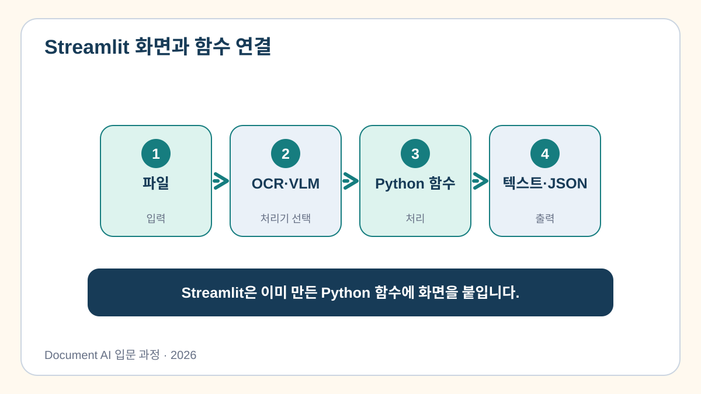
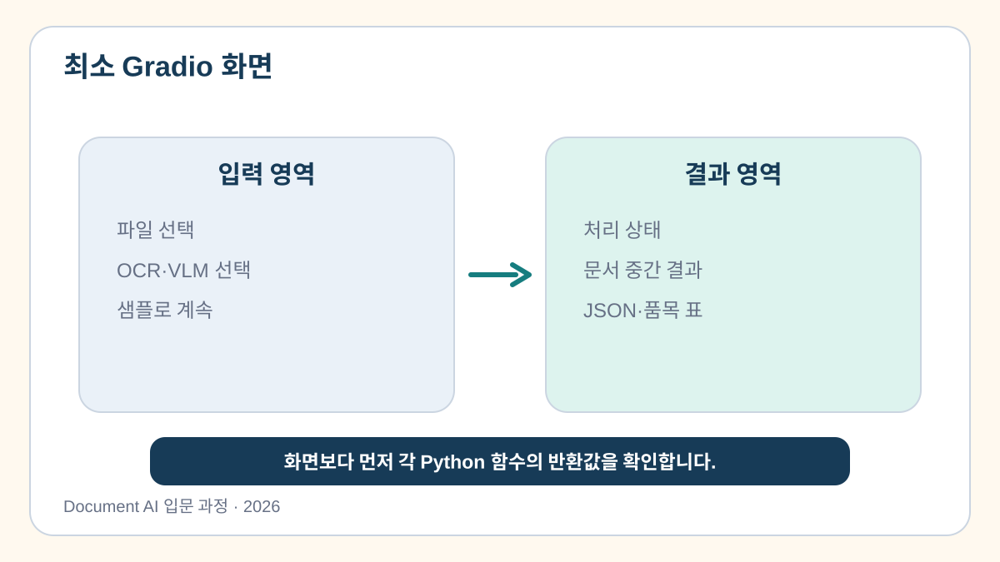
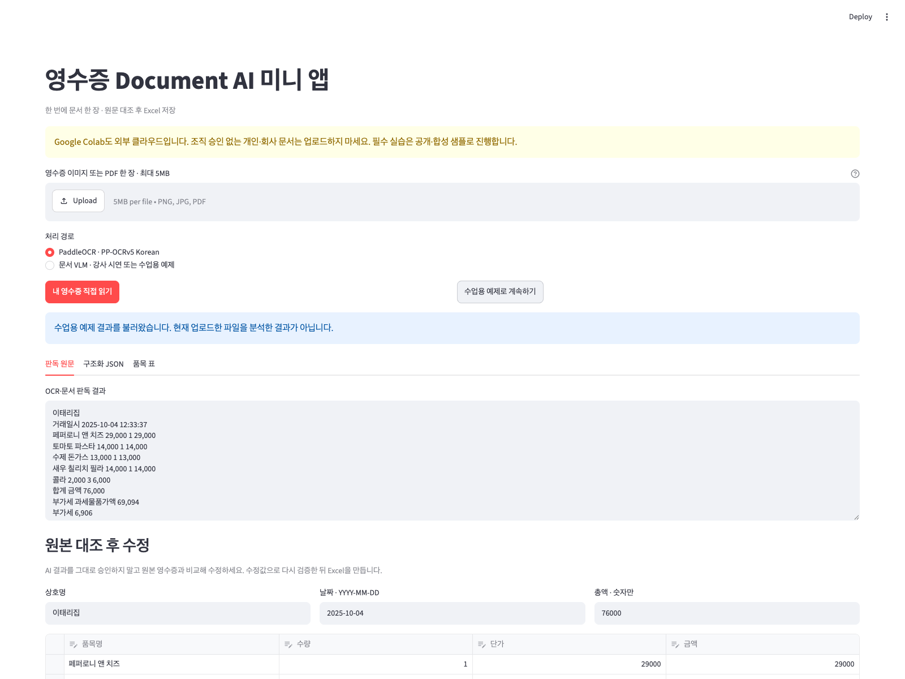

# 5교시. 문서 자동화 웹 애플리케이션 기본 구현

지금까지 만든 코드는 Colab 셀 안에서 실행했습니다. 실제 사용자는 Python 함수를 직접 호출하는 대신 문서를 올리고 버튼을 누른 뒤 결과를 확인할 수 있는 화면을 필요로 합니다.

이번 시간에는 파일 선택, 실행 버튼, 판독 원문, 구조화 결과를 한 화면에 배치해 간단한 문서 자동화 웹앱을 만듭니다. OCR 연결은 다음 교시에서 진행하므로, 먼저 화면과 데이터가 올바르게 연결되는지 확인합니다.

[5교시 Colab 실습 열기](https://colab.research.google.com/github/leecks1119/document_ai_lecture/blob/document_ai_lecture_2026/colab/05_streamlit_basic.ipynb)

## 화면과 문서 처리 코드는 역할이 다릅니다

문서 자동화 앱은 크게 두 부분으로 나눌 수 있습니다.

```text
화면
  사용자가 파일을 선택하고 버튼을 누릅니다.
  처리 상태, 원문, JSON, 오류를 보여 줍니다.

처리 함수
  전달받은 파일을 읽습니다.
  OCR, 항목 추출, 검증을 실행합니다.
  화면에 보여 줄 결과를 반환합니다.
```



화면과 처리 함수를 나누면 OCR 모델을 바꾸더라도 화면 전체를 다시 만들 필요가 없습니다. 반대로 화면의 제목이나 버튼을 바꿔도 OCR 로직에는 영향을 주지 않습니다.

## 이번에 만들 화면



화면에는 다음 요소가 필요합니다.

1. 앱의 용도를 알려 주는 제목과 설명
2. 영수증 이미지나 PDF를 선택하는 영역
3. 문서 처리를 시작하는 버튼
4. 현재 어떤 처리를 했는지 알려 주는 상태
5. OCR 원문과 구조화 JSON을 확인하는 결과 영역

좋은 화면은 단순히 보기 좋은 화면이 아닙니다. 사용자가 어떤 파일을 처리했고, 실제 처리가 실행되었는지, 결과가 준비 예제인지도 알 수 있어야 합니다.

## Streamlit 코드를 읽어 봅시다

실습에서는 Python 코드만으로 웹 화면을 만들 수 있는 Streamlit을 사용합니다.

```python
st.title("영수증 Document AI 미니 앱")
uploaded = st.file_uploader("영수증 이미지 또는 PDF 한 장")

if st.button("문서 처리"):
    ...

st.text_area("판독 원문", ...)
st.json(...)
```

모든 문법을 외울 필요는 없습니다. 각 줄이 화면의 어느 부분을 만드는지 연결해서 이해하면 됩니다.

- `st.title`은 화면의 제목을 만듭니다.
- `st.file_uploader`는 사용자의 파일을 받습니다.
- `st.button`은 처리를 시작할 시점을 정합니다.
- `st.text_area`와 `st.json`은 결과를 사람이 읽을 수 있게 보여 줍니다.

## 직접 해보기

### 1. 앱 제목과 버튼 문구를 정합니다

노트북의 빈칸에 앱 제목과 실행 버튼의 문구를 적습니다. 예를 들어 제목을 `영수증 정리 도우미`, 버튼을 `영수증 읽기`로 바꿀 수 있습니다.

자신의 업무에서 사용할 도구라고 생각하고 이름을 정해 보세요. 문법이 막히면 빈칸 아래의 힌트와 완성 코드를 확인할 수 있습니다.

### 2. 업로드한 파일 정보를 확인합니다

파일을 선택하면 화면에 파일명과 크기가 표시됩니다. 이 값이 실제로 선택한 파일과 같은지 확인합니다.

업로드 영역이 있어도 코드가 업로드된 바이트를 읽지 않는다면 실제 문서 처리는 시작되지 않습니다. 다른 파일을 선택했을 때 파일명과 크기가 바뀌는지 확인하는 것이 첫 번째 점검입니다.

### 3. 준비된 영수증 결과를 화면에 표시합니다

이번 교시에서는 아직 OCR 모델을 연결하지 않습니다. 대신 공개 한국 영수증의 검수된 예제 결과를 사용해 화면의 전체 흐름을 확인합니다.

`준비 결과로 실행` 버튼을 누르면 다음 내용이 나타납니다.

- 준비된 예제를 사용했다는 안내
- 공개 영수증의 판독 원문
- 상호명, 날짜, 품목, 합계가 들어 있는 JSON

이 결과는 방금 업로드한 파일을 OCR로 처리한 결과가 아닙니다. 화면 연결을 확인하기 위한 예제라는 점을 구분해서 봅니다.

### 4. 화면을 직접 눌러 봅니다

노트북의 자동 확인 셀을 실행한 뒤 Colab 출력 영역에서 앱 미리보기를 엽니다. 이 미리보기는 수업 중인 Colab 런타임 안에서만 사용하며 공개 배포 주소가 아닙니다.

다음 순서로 조작해 보세요.

1. 파일을 선택합니다.
2. 파일명과 크기가 바뀌는지 확인합니다.
3. 준비 결과 버튼을 누릅니다.
4. 판독 원문과 JSON이 함께 나타나는지 확인합니다.
5. 자신이 수정한 제목과 버튼 문구가 보이는지 확인합니다.

아래 화면은 같은 준비 결과를 앱에서 표시한 예입니다.



## 화면을 보며 생각해 볼 점

결과 영역에 JSON만 표시하면 개발자는 이해할 수 있지만 일반 사용자는 무엇을 확인해야 할지 모를 수 있습니다. 실제 업무용 화면에는 다음 정보가 함께 필요합니다.

- 처리한 파일의 이름
- 실제 모델 실행인지 준비 예제인지 나타내는 상태
- 사람이 원본과 비교해야 할 주요 항목
- 오류가 발생한 단계와 다시 시도할 방법
- 승인 전에는 저장할 수 없다는 안내

이러한 정보는 6교시와 7교시에서 차례대로 추가합니다.

## 실습 결과

실습을 마치면 `course_outputs/app_05.py`가 만들어집니다. 파일에는 업로드 영역, 버튼, 판독 원문, JSON 결과 화면이 들어 있습니다.

다음 내용을 확인하면 이번 실습을 마친 것입니다.

- 다른 파일을 선택하면 파일명과 크기가 바뀝니다.
- 버튼을 누르면 준비된 원문과 JSON이 나타납니다.
- 자신의 앱 제목과 버튼 문구가 화면에 표시됩니다.
- 화면과 문서 처리 함수가 서로 다른 역할을 한다고 설명할 수 있습니다.

다음 교시에는 업로드한 파일을 실제 PaddleOCR 함수에 연결합니다.

## 잘되지 않을 때

- `streamlit`을 찾을 수 없다는 오류가 나오면 설치 셀부터 다시 실행합니다.
- 앱 제목이 보이지 않으면 앱 코드를 저장하는 셀을 먼저 실행했는지 확인합니다.
- 파일을 바꿨는데 파일명이 그대로라면 업로드된 파일을 읽는 코드가 연결되었는지 확인합니다.

## 참고자료

Streamlit 구성 요소와 안전한 미리보기에 관한 공식 근거는 [과정 참고자료의 5교시 항목](../docs/course_references.md)에서 확인할 수 있습니다.
