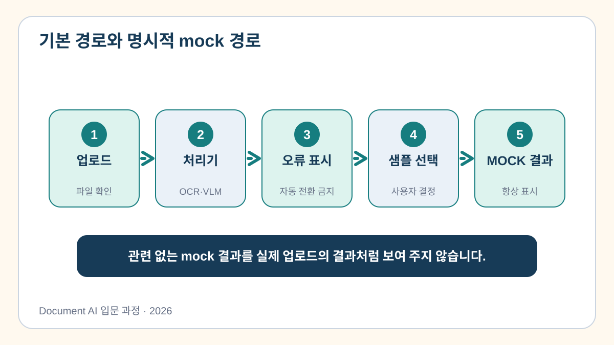

# 6교시. OCR 및 정보 추출 기능 연동

5교시의 앱은 파일을 받을 수 있었지만, 아직 업로드한 문서를 OCR로 처리하지는 않았습니다. 이번 시간에는 화면에서 받은 파일을 실제 PaddleOCR 함수에 전달하고, 판독 원문과 구조화 결과가 다시 화면에 나타나도록 연결합니다.

이 연결이 완성되면 “문서 한 장을 넣어 결과를 확인하는 작은 프로토타입”의 기본 형태가 갖춰집니다.

[6교시 Colab 실습 열기](https://colab.research.google.com/github/leecks1119/document_ai_lecture/blob/document_ai_lecture_2026/colab/06_ocr_ai_integration.ipynb)

## 문서 처리 경로를 다시 확인합니다

```text
사용자가 파일 선택
  → 파일 형식과 크기 확인
  → PaddleOCR로 글자와 위치 판독
  → 읽기 순서와 품목 행 정리
  → 상호명·날짜·품목·합계 추출
  → 원문과 JSON을 화면에 표시
```

각 단계를 함수로 나누면 오류가 났을 때 어느 단계에서 실패했는지 찾기 쉽습니다. OCR 오류와 JSON 변환 오류를 같은 메시지로 표시하면 사용자는 무엇을 고쳐야 할지 알 수 없습니다.

## 문서에 따라 먼저 선택할 방법이 다릅니다

모든 문서를 이미지로 바꾸어 OCR에 넣는 것이 항상 좋은 방법은 아닙니다.

| 입력 문서 | 먼저 검토할 방법 | 주의할 점 |
| --- | --- | --- |
| 선명한 영수증 사진 | 한국어 OCR과 규칙 | 날짜와 합계의 다양한 표기 |
| 복잡한 표·레이아웃 이미지 | 문서 VLM과 출력 형식 지정 | 비용, 지연, 잘못 생성한 값 |
| Excel | 셀과 수식을 직접 읽기 | 병합 셀, 숨김 시트, 숫자 서식 |
| Word | 문단과 표를 직접 읽기 | 머리글, 텍스트 상자, 이미지 본문 |
| PDF | 텍스트를 선택할 수 있는지 먼저 확인 | 스캔 페이지와 텍스트 페이지 혼합 |
| PowerPoint | 도형, 표, 이미지를 직접 읽기 | 그룹 도형과 읽기 순서 |
| 표 캡처 | OCR 뒤 행과 열 복원 | 셀 관계가 이미지에서 사라짐 |

원본 파일에 셀이나 문단 구조가 남아 있다면 그 구조를 먼저 활용합니다. 문서가 이미지뿐일 때 OCR이나 VLM을 선택합니다.

## 실제 OCR 함수를 연결합니다

앱의 `run_live_ocr` 함수는 업로드된 파일을 임시로 저장하고 PaddleOCR에 전달합니다.

```python
engine = PaddleOCR(
    lang="korean",
    ocr_version="PP-OCRv5",
    device="cpu",
)
```

이 함수가 반환해야 하는 것은 OCR 문자열 하나뿐이 아닙니다.

- 어떤 파일을 처리했는지
- OCR이 읽은 원문은 무엇인지
- 상호명, 날짜, 품목, 합계가 어떻게 정리되었는지
- 실행 중 오류가 있었는지
- 실제 실행인지 준비된 예제인지

## 세 가지 상태를 구분해서 보여 줍니다

문서 자동화 앱은 성공한 결과만 보여 주어서는 안 됩니다.

### 실제 실행

사용자가 올린 파일에 OCR과 정보 추출을 실행한 상태입니다. 화면 내부에서는 `LIVE`로 기록됩니다.

### 실제 실행 오류

파일이 없거나, 모델을 불러오지 못했거나, 결과를 JSON으로 바꾸지 못한 상태입니다. 화면 내부에서는 `LIVE_ERROR`로 기록됩니다. 오류가 발생했는데 이전 예제 결과를 성공한 것처럼 보여 주면 안 됩니다.

### 준비된 예제

네트워크나 모델 다운로드 문제로 수업 진행이 어려울 때 사용자가 직접 선택하는 검수 예제입니다. 화면 내부에서는 `PREPARED_FALLBACK`으로 기록됩니다.



세 상태를 구분하는 이유는 간단합니다. 사용자는 화면에 값이 보인다는 사실만으로 자신의 문서가 처리되었다고 생각할 수 있기 때문입니다.

## 직접 해보기

### 1. 준비된 예제로 화면 전체를 확인합니다

먼저 `준비 결과로 실행` 버튼을 눌러 다음 영역이 모두 나타나는지 확인합니다.

- 처리 상태
- OCR 판독 원문
- 구조화한 JSON
- 품목 표

준비된 예제라는 안내가 분명하게 표시되어야 합니다.


### 2. 실제 영수증을 업로드합니다

2교시에서 PaddleOCR 설치가 유지된 Colab 런타임이라면 공개 영수증을 업로드하고 `업로드 문서 처리` 버튼을 누릅니다.

처리가 끝난 뒤 다음 내용을 차례로 확인하세요.

1. 화면의 파일명이 업로드한 파일명과 같습니다.
2. 상태가 실제 실행으로 표시됩니다.
3. 판독 원문이 영수증의 내용으로 바뀌었습니다.
4. JSON의 상호명과 합계가 원본과 같습니다.
5. 품목 다섯 개가 각각 올바른 금액과 연결되었습니다.

합계가 `76000`으로 나왔다는 사실만 확인하지 마세요. 품목명, 단가, 수량, 금액이 같은 행으로 묶였는지도 원본과 비교합니다.

### 3. 오류 화면도 확인합니다

파일을 선택하지 않고 실제 처리 버튼을 눌러 보세요. 앱은 결과를 만들어 내는 대신 입력 파일이 필요하다는 메시지를 보여 주어야 합니다.

이 경험은 실제 업무에서 중요합니다. 실패한 요청을 성공으로 보이게 만드는 것보다, 왜 처리할 수 없었는지 정확히 알려 주는 편이 안전합니다.

### 4. 반드시 확인할 항목을 정합니다

노트북의 빈칸에 실제 처리 후 확인할 항목을 적습니다. 이번 영수증에서는 다음 항목을 권합니다.

- 처리한 파일명
- 상호명
- 거래일시
- 품목 수
- 합계 금액
- 합계의 원본 문자열

자신이 담당하는 업무라면 어떤 항목이 틀렸을 때 가장 큰 문제가 생길지도 함께 생각해 보세요.

## 실습 결과

실습이 끝나면 `course_outputs/app_06.py`가 만들어집니다. 이 앱은 업로드된 파일을 OCR과 정보 추출 함수에 연결하고, 실제 실행·오류·준비 예제 상태를 구분해 보여 줍니다.

이번 교시를 마치면 다음을 설명할 수 있어야 합니다.

- 업로드된 파일이 어느 함수를 거쳐 JSON이 되는가?
- 화면에 값이 보이는 것만으로 실제 처리가 성공했다고 말할 수 없는 이유는 무엇인가?
- 합계가 맞더라도 품목 행을 함께 확인해야 하는 이유는 무엇인가?
- Excel이나 Word 원본을 무조건 이미지 OCR로 처리하면 안 되는 이유는 무엇인가?

다음 교시에는 추출 결과를 업무 규칙으로 검사하고, 사람이 수정·승인한 값만 Excel로 저장하도록 만듭니다.

## 잘되지 않을 때

- PaddleOCR을 찾을 수 없으면 2교시의 설치 셀을 다시 실행합니다.
- 모델 다운로드가 3분 이상 진행되지 않으면 준비된 예제로 실습을 이어 갑니다.
- 업로드하지 않은 상태에서 입력 오류가 나타나는 것은 정상입니다.
- 오류가 발생했을 때 다른 문서의 결과를 현재 문서의 성공 결과로 사용하지 않습니다.

## 참고자료

OCR 연동과 문서 형식별 처리 방식의 공식 근거는 [과정 참고자료의 6교시 항목](../docs/course_references.md)에서 확인할 수 있습니다.
