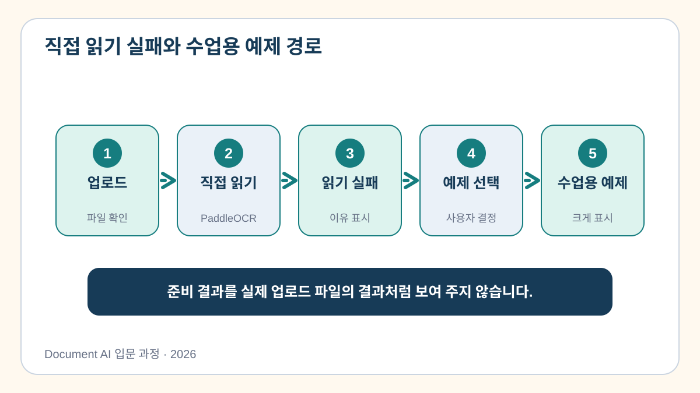

# 6교시. OCR 및 정보 추출 기능 연동

5교시에는 파일을 올릴 수 있는 화면을 만들었습니다. 이제 현재 이미지를 실제
`PP-OCRv5 Korean`으로 읽고, 결과를 영수증 JSON으로 바꾼 뒤 같은 기능을 앱
버튼에 연결합니다.

> **이번 시간의 도착점:** 내 이미지 한 장을 실제 OCR 모델로 처리하고 상호명,
> 날짜, 총액, 품목 수를 화면에서 확인합니다.

[Colab 실습 열기](https://colab.research.google.com/github/leecks1119/document_ai_lecture/blob/master/colab/06_ocr_ai_integration.ipynb)



## 이번 실습의 처리 과정

```text
이미지 한 장
  → PP-OCRv5가 글자와 위치 판독
  → 위치를 이용해 행 순서 복원
  → Python 규칙으로 상호명·날짜·품목·합계 추출
  → JSON 화면 표시
```

OCR 모델과 Python 규칙의 역할을 섞어 부르지 않습니다. OCR은 글자를 읽고,
규칙은 읽힌 글자를 업무 필드로 옮깁니다.

## 직접 해보기

### 1. 실제 모델 결과를 먼저 봅니다

이미지를 선택하고 셀을 실행하면 다음 함수가 현재 파일을 읽습니다.

```python
ocr_tokens = extract_with_paddleocr(INPUT_PATH)
```

실제 Colab에서는 다음 결과를 확인합니다.

```text
실제 모델 실행: True
상호명: ...
날짜: ...
총액: ...
품목 수: ...
```

값이 `None`이거나 틀렸다면 실패를 숨기지 말고 원본과 비교합니다. 모델 실행
성공과 값의 정확성은 서로 다른 문제입니다.

### 2. 실제 OCR 연결 앱을 엽니다

노트북은 같은 함수를 사용하는 `app_06.py`를 만듭니다. 마지막 셀에서 앱을 열고
다음 순서로 조작합니다.

1. 비식별 영수증 이미지 한 장을 올립니다.
2. `현재 파일을 PP-OCRv5로 읽기` 버튼을 누릅니다.
3. `지금 선택한 이미지를 실제 모델로 읽었습니다` 문구를 확인합니다.
4. OCR 원문과 영수증 JSON을 확인합니다.

파일을 선택하지 않고 버튼을 누르면 앱은 결과를 만들지 않고 먼저 이미지를
선택하라고 안내합니다.


## 반드시 원본과 비교할 값

- 거래 날짜
- 총액
- 품목 수와 각 품목 금액

상호명처럼 맞춤법이 틀려도 사람이 바로 알아볼 수 있는 값과, 총액처럼 한 글자
오류가 업무 사고로 이어지는 값을 구분합니다.

## 이번 시간의 정리

현재 이미지, 실제 모델 실행, OCR 원문, 업무 JSON이 한 흐름으로 이어져야
연동입니다. 모델 실행 성공과 값의 정확성은 따로 확인합니다.

## 완료 확인

- 현재 이미지에 PP-OCRv5를 실제 실행했습니다.
- OCR 원문과 구조화 JSON을 확인했습니다.
- 실제 OCR 연결 앱을 열었습니다.
- `course_outputs/app_06.py`를 만들었습니다.

다음 교시에는 결과를 검증하고 승인된 값만 Excel로 저장합니다.

## 참고자료

- [PaddleOCR 공식 문서](https://www.paddleocr.ai/)
- [Streamlit 공식 문서](https://docs.streamlit.io/)
