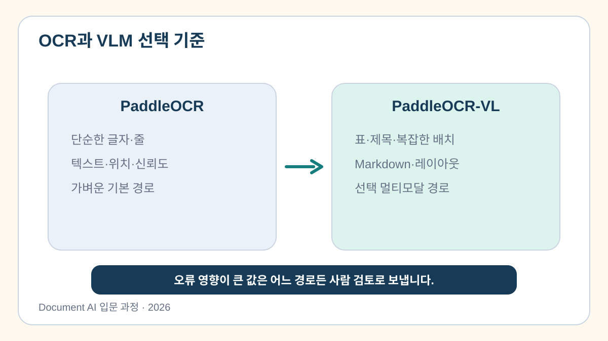

# 6교시. OCR 및 정보 추출 기능 연동

> **이번 교시의 한 문장:** 파일에서 JSON까지 단계를 연결하면 실제 처리와 실패 위치를 구분할 수 있습니다.

[Colab 실습 열기](https://colab.research.google.com/github/leecks1119/document_ai_lecture/blob/document_ai_lecture_2026/colab/06_ocr_ai_integration.ipynb)

## 60분 뒤 남길 것

- 업로드 파일을 실제 PaddleOCR 함수에 연결합니다.
- `LIVE`, `LIVE_ERROR`, `PREPARED_FALLBACK`을 화면에서 구분합니다.
- 오류가 나도 관련 없는 결과로 조용히 바꾸지 않습니다.
- `course_outputs/app_06.py`를 만듭니다.

## 개념 10%: 가장 단순한 경로부터 선택합니다

| 입력 | 먼저 검토할 경로 | 어려운 점 |
| --- | --- | --- |
| 선명한 영수증 사진 | 한국어 OCR + 규칙 | 날짜·합계 표기 변형 |
| 복잡한 표·레이아웃 | 문서 VLM + 스키마 | 비용·지연·환각 |
| Excel | 셀·수식 직접 읽기 | 병합·숨김·서식 |
| Word | 문단·표·그림 직접 읽기 | 머리글·텍스트박스·변경 추적 |
| PDF | 텍스트층 확인 후 OCR | 스캔 혼합·암호·문자맵 |
| PPT | 도형·표·이미지 직접 읽기 | 그룹·읽기 순서·노트 |
| 표 캡처 | OCR + 표 구조 복원 | 행·열 관계가 픽셀로 사라짐 |

OCR과 VLM은 고정된 순서가 아니라 문서와 위험에 따라 선택하는 경로입니다.



## 실습 90%

### 1. 앱의 실제 처리 함수를 확인합니다

`run_live_ocr(uploaded)`는 업로드된 바이트를 임시 파일로 저장하고 PaddleOCR을 실행합니다.

```python
engine = PaddleOCR(
    lang="korean",
    ocr_version="PP-OCRv5",
    device="cpu",
)
```

### 2. 세 상태를 일부러 구분합니다

```text
LIVE
  업로드 파일에 실제 OCR을 실행하고 JSON 생성

LIVE_ERROR
  파일 없음·모델 오류·파싱 오류를 표시
  Excel이나 준비 결과로 조용히 넘어가지 않음

PREPARED_FALLBACK
  사용자가 공개 샘플 준비 결과 버튼을 직접 선택
```


### 3. 준비 결과 경로로 화면을 완주합니다

AppTest는 네트워크 없이 준비 결과 버튼을 눌러 다음을 확인합니다.

- 실행 모드
- OCR 원문
- 구조화 JSON
- 오류 없는 앱 화면

정상 결과:

```text
CHECKPOINT 1/1 PASS: 앱 연결·모드 표시·JSON 출력
```

노트북에는 실제 PP-OCRv5 LIVE 실행에서 보존한 44개 토큰 회귀 사례도 들어 있습니다. 공간 순서를 복원한 뒤 `총액 76000`, `품목 5개`가 되는지 자동 확인하여 “앱만 열리고 결과는 틀리는” 문제를 막습니다.

```text
RECORDED LIVE REGRESSION PASS: 76000 5
```

### 4. LIVE 확인 항목을 직접 정합니다

`LIVE_PASS_FIELDS` 빈칸에는 실제 처리에서 반드시 확인할 필드를 적습니다. 자기 답을 먼저 실행하고 힌트·전체 정답과 비교합니다.

### 5. Colab에서 LIVE 경로를 시도합니다

2교시 설치가 유지된 런타임에서는 공개 영수증을 업로드해 `업로드 파일 LIVE 처리`를 누릅니다. 파일명, 실행 모드, OCR 원문, JSON이 모두 바뀌어야 실제 연결입니다.

마지막 Streamlit 미리보기에서 LIVE 버튼과 준비 결과 버튼을 직접 눌러 상태가 섞이지 않는지 확인합니다.

실제 앱의 준비 결과 화면은 아래와 같습니다. 이 화면에는 반드시 `PREPARED REPLAY`가 표시되어야 하며, LIVE 실행 결과로 해석하면 안 됩니다.


## 통과 기준

- `app_06.py`에 `run_live_ocr`가 있습니다.
- 실제 파일 오류가 `LIVE_ERROR`로 보입니다.
- 준비 결과는 사용자가 버튼으로 선택한 경우에만 표시됩니다.
- AppTest에서 `PREPARED_FALLBACK`과 JSON이 확인됩니다.
- 실제 기록 회귀 검사가 합계와 품목 수를 통과합니다.

## 막혔을 때

- PaddleOCR 미설치 오류면 2교시 설치 셀을 다시 실행합니다.
- 모델 다운로드가 3분을 넘으면 중지하고 준비 결과 버튼을 선택합니다.
- 업로드 없이 LIVE 버튼을 누르면 `INPUT_ERROR`가 정상입니다.
- 오류 문구를 지우거나 다른 문서 결과로 바꾸지 않습니다.

다음 교시에는 JSON을 규칙으로 검증하고 원본을 승인한 뒤에만 Excel을 만듭니다.

## 참고 자료

공식 근거는 [과정 참고자료와 적용 범위](../docs/course_references.md)의 6교시 표에서 확인할 수 있습니다.
