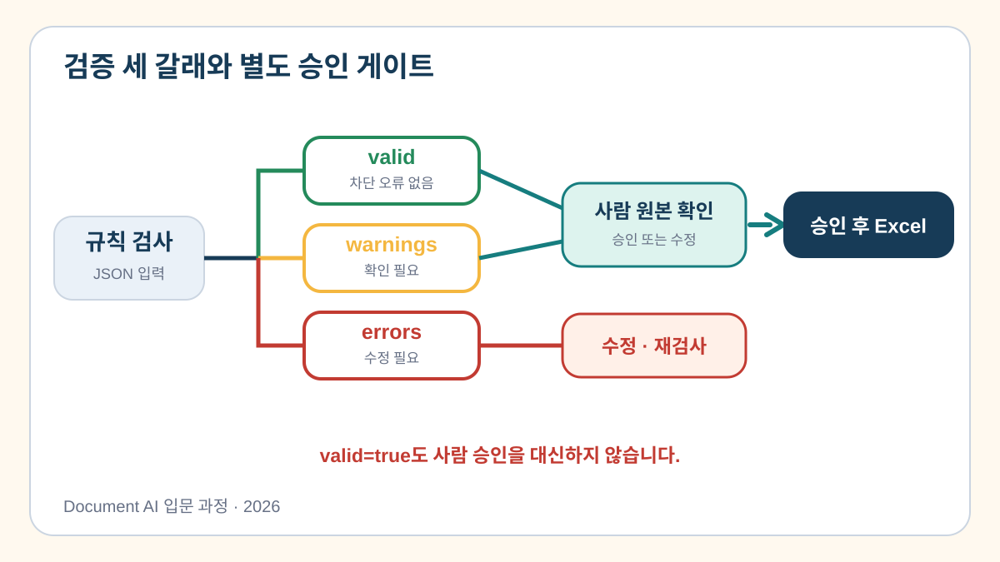
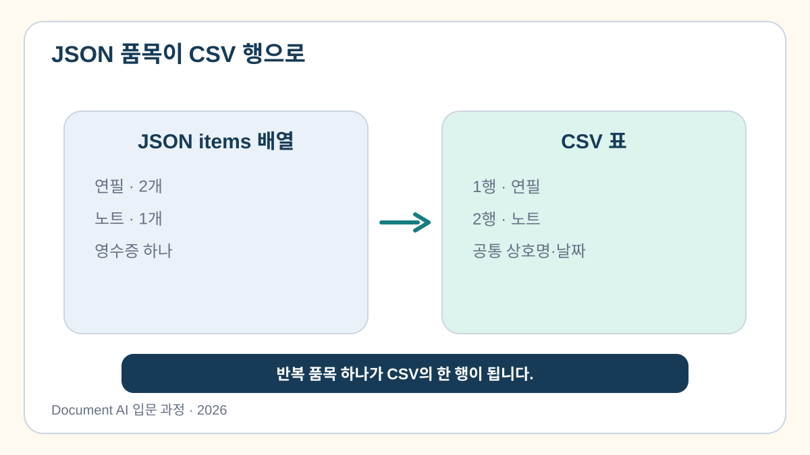

# 7교시. 틀린 값을 걸러 CSV로 저장하기

> 필수값과 품목 합계를 검사하고 안전한 CSV 파일을 만듭니다.

[](https://colab.research.google.com/github/leecks1119/document_ai_lecture/blob/document_ai_lecture_2026/colab/07_validation_export.ipynb)

## 1. 학습 목표

- `valid`, `warnings`, `errors`를 구분할 수 있다.
- 필수값과 품목 합계 규칙을 코드로 확인할 수 있다.
- 영수증의 반복 품목을 CSV 행으로 바꿀 수 있다.

## 2. 이번 교시의 결과물

- `receipt.csv`: 검증된 합성 영수증의 품목 두 행

## 3. 시작하기 전에

### 선수 지식

- `if`, 리스트, 딕셔너리를 읽을 수 있으면 충분하다.

### 준비 파일

- [정상 JSON](../sample_outputs/extracted_result.json)
- [7교시 Colab 노트북](../colab/07_validation_export.ipynb)
- 저장소의 `src/validate.py`, `src/export.py`

테스트 데이터와 CSV 보조 함수는 제공된다. 학습자는 필수값과 품목 합계 두 규칙만 확인한다.

## 4. 핵심 개념

### 4.1 정상·경고·오류는 다음 행동이 다르다



- `valid`: 현재 규칙에서 저장 가능
- `warnings`: 사람 확인 후 진행 가능
- `errors`: 수정 전에는 저장하면 안 됨

### 4.2 자료형과 업무 규칙은 다르다

총액 `6000`은 정수라서 자료형은 맞지만, 품목 합계 `5000`과 다르므로 업무 규칙 오류다.

> **쉬운 비유**
> 검증 함수는 정해진 규칙에 걸리는 항목을 찾는 공항 보안 검색대와 같다.

비유의 한계: 검색대를 통과했다고 내용의 의미와 사용 목적까지 올바른 것은 아니다. 중요한 값은 원문과 비교한다.

### 4.3 품목 하나가 CSV 한 행이 된다



상호명·날짜·총액은 각 품목 행에 반복하고, 품목명·수량·단가·소계는 행마다 달라진다.

## 5. 전체 실습 흐름

```text
제공된 JSON 세 개
  → 필수값 검사
  → 품목 합계 검사
  → 오류가 없는 결과 선택
  → CSV 두 행 생성
  → receipt.csv 다운로드
```

## 6. 단계별 실습

### 실습 1. 두 가지 검증 규칙 확인하기

노트북이 제공하는 정상·상호명 누락·합계 불일치 데이터를 완성된 두 규칙에 차례로 넣어 결과를 비교한다.

```python
def validate_receipt(data):
    errors = []

    for field in ("store_name", "date", "total_amount", "items"):
        if data.get(field) in (None, "", []):
            errors.append(f"필수값 누락: {field}")

    item_sum = sum(item["line_total"] for item in data.get("items", []))
    if data.get("total_amount") != item_sum:
        errors.append("품목 합계와 총액이 다릅니다.")

    return {"valid": not errors, "warnings": [], "errors": errors}
```

**기대 결과**

- 정상 데이터: `valid=True`
- 상호명 누락: `필수값 누락: store_name`
- 합계 불일치: `품목 합계와 총액이 다릅니다.`

CSV 생성과 수식 문자 보호 함수는 완성 코드로 제공된다.

**mock 대체 경로**

OCR·VLM 모델이 없어도 노트북의 `SAMPLE_RECEIPT`를 같은 검증 함수에 전달한다. Gradio 다운로드가 안 되면 Colab의 `files.download()`를 사용한다.

## 7. Codex 활용

### 요청 목표

검증 함수가 전체 정확도나 고정 신뢰도 기준에 의존하지 않는지 확인한다.

### 실습 프롬프트

```text
목표: 영수증 검증 함수에서 실제 오류를 놓치는지 검토해줘.
맥락: 필수값과 품목 합계 두 규칙만 가르치는 초보자 실습이야.
제약조건: 이메일·전화번호·복잡한 통계·고정 신뢰도 임계값을 추가하지 마.
완료 기준: 정상, 누락, 합계 불일치 세 데이터의 예상 결과를 표로 알려줘.
```

### 생성 결과 확인

- 이번 실습에 없는 규칙을 과도하게 추가하지 않았는가?
- 오류가 있으면 `valid=False`가 되는가?

## 8. 문제 해결

| 증상 | 원인 | 해결 방법 |
| --- | --- | --- |
| 정상 데이터도 합계 오류 | `line_total` 대신 단가를 더함 | 품목의 `line_total` 합 확인 |
| CSV 한글 깨짐 | 일반 UTF-8로 저장 | 제공 함수의 `utf-8-sig` 사용 |
| 다운로드 버튼 오류 | Gradio 세션 문제 | Colab `files.download()` 사용 |

## 9. 형성평가

1. 총액 자료형이 정수여도 품목 합계와 다르면 어떻게 처리하는가?
2. 날짜 형식이 맞으면 원문과도 같다고 확정할 수 있는가?

<details>
<summary>정답 보기</summary>

1. 이번 규칙에서는 `error`로 표시하고 저장 전에 수정한다.
2. 아니다. 원문과 다시 비교한다.

</details>

## 10. 핵심 요약

- 검증 결과는 정상·경고·오류로 나눈다.
- 자료형 검사와 업무 규칙 검사는 다르다.
- 반복 품목은 CSV의 여러 행으로 펼친다.

## 11. 완료 체크리스트

- [ ] 필수값과 품목 합계 규칙을 실행했다.
- [ ] 세 테스트 데이터의 결과를 비교했다.
- [ ] `receipt.csv`를 만들었다.

## 12. 다음 교시 예고

8교시에서는 새 기능을 추가하지 않고 전체 흐름을 점검한 뒤 사람 검토가 포함된 적용 카드를 만든다.

## 참고 자료

- [Google Document AI 평가](https://docs.cloud.google.com/document-ai/docs/evaluate)
- [OWASP CSV Injection](https://owasp.org/www-community/attacks/CSV_Injection)
