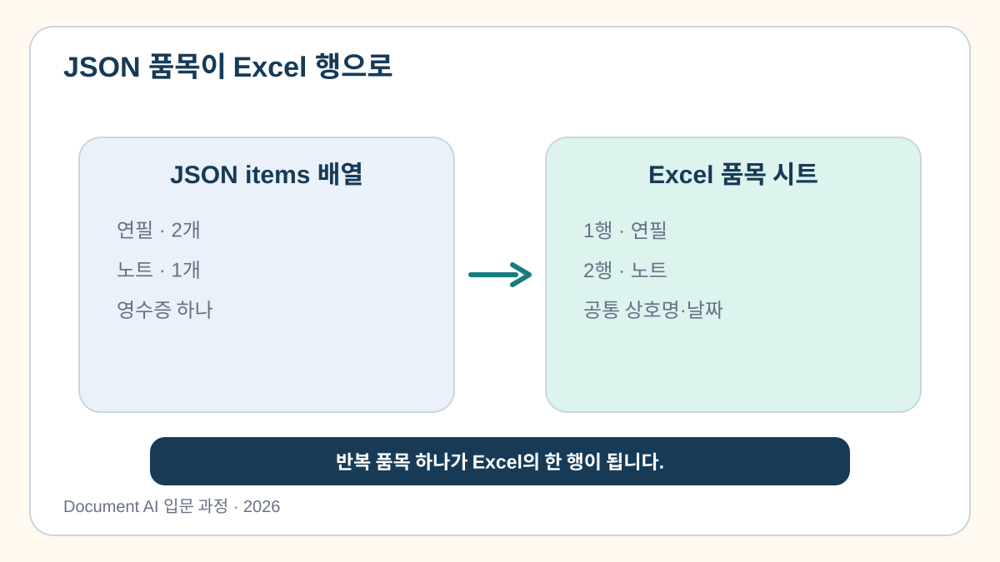

# 7교시. 추출 결과 검증 및 데이터 저장

> 날짜·금액·품목 합계를 검사하고 사람이 원본을 확인한 값만 업무용 Excel로 저장합니다.
>
> **핵심 메시지:** AI가 만든 JSON은 검증과 사람 확인을 통과해야 비로소 사용할 수 있는 업무 데이터가 됩니다.

[](https://colab.research.google.com/github/leecks1119/document_ai_lecture/blob/document_ai_lecture_2026/colab/07_validation_export.ipynb)

## 1. 학습 목표

- `valid`, `warnings`, `errors`를 구분할 수 있다.
- 필수값·날짜 형식·금액·품목 합계를 검사할 수 있다.
- 오류가 없는 결과만 안전한 `receipt_result.xlsx`로 저장할 수 있다.

## 2. 이번 교시의 결과물

- `receipt_result.xlsx`: 원문·정제값·최종값·검토 상태와 품목 행을 담은 Excel 파일

## 3. 시작하기 전에

### 선수 지식

- `if`, 리스트, 딕셔너리를 읽을 수 있으면 충분하다.

### 준비 파일

- 6교시의 통합 프로토타입 또는 교재에 포함된 완성 복구본
- [정상 JSON](../sample_outputs/extracted_result.json)
- [7교시 Colab 노트북](../colab/07_validation_export.ipynb)

준비된 테스트 데이터와 Excel 저장 함수를 사용합니다. 필수값과 품목 합계 규칙을 실행하고, 오류가 있으면 Excel 생성이 차단되는지 직접 확인합니다. Excel 파일은 노트북에 준비된 안전 저장 함수로 만듭니다.

## 4. 핵심 개념

### 4.1 정상·경고·오류는 다음 행동이 다릅니다


- `valid`: 현재 규칙에서 저장할 수 있습니다.
- `warnings`: 사람 확인 후 진행할 수 있습니다.
- `errors`: 수정 전에는 저장하면 안 됩니다.

### 4.2 자료형과 업무 규칙은 다릅니다

총액 `6000`은 정수라서 자료형은 맞지만, 품목 합계 `5000`과 다르므로 업무 규칙 오류입니다.

> **쉬운 비유**
> 검증 함수는 정해진 규칙에 걸리는 항목을 찾는 공항 보안 검색대와 같습니다.

비유의 한계: 검색대를 통과했다고 내용의 의미와 사용 목적까지 올바른 것은 아닙니다. 중요한 값은 원문과 비교합니다.

### 4.3 품목 하나가 Excel의 한 행이 됩니다



상호명·날짜·총액은 각 품목 행에 반복하고, 품목명·수량·단가·소계는 행마다 달라집니다.

## 5. 전체 실습 흐름

```text
제공된 검증용 JSON 다섯 개
  → 필수값 검사
  → 품목 합계 검사
  → 원본 대조와 사람 확인
  → 오류가 없는 결과 선택
  → receipt_result.xlsx 생성
  → Excel 다운로드
```

## 6. 단계별 실습

### 실습 1. 검증과 사람 승인 뒤 Excel 만들기

노트북이 제공하는 정상·상호명 누락·날짜 형식·금액 형식·합계 불일치 데이터를 완성된 규칙에 차례로 넣어 결과를 비교합니다.

```python
def validate_receipt(data):
    errors = []

    for field in ("store_name", "date", "total_amount", "items"):
        if data.get(field) in (None, "", []):
            errors.append(f"필수값 누락: {field}")

    if data.get("date") and not is_iso_date(data["date"]):
        errors.append("date는 YYYY-MM-DD 형식이어야 합니다.")

    total_amount = data.get("total_amount")
    if total_amount is not None and (
        not isinstance(total_amount, int) or total_amount < 0
    ):
        errors.append("total_amount는 0 이상의 정수여야 합니다.")

    item_sum = sum(item["line_total"] for item in data.get("items", []))
    if isinstance(total_amount, int) and total_amount != item_sum:
        errors.append("품목 합계와 총액이 다릅니다.")

    return {"valid": not errors, "warnings": [], "errors": errors}
```

**기대 결과**

- 정상 데이터: `valid=True`
- 상호명 누락: `필수값 누락: store_name`
- 날짜·금액 형식 오류: 각각 형식 오류가 표시됨
- 합계 불일치: `품목 합계와 총액이 다릅니다.`

Excel 생성과 수식 문자 보호 함수는 완성 코드로 제공됩니다. 규칙 검사와 원본 확인을 모두 통과해야 Excel을 만들 수 있습니다. 둘 중 하나라도 끝나지 않았다면 먼저 오류를 고치거나 원본을 확인하세요.

먼저 미승인 상태에서 파일 생성이 차단되는지 확인합니다. 그다음 원본에서 상호명·날짜·총액을 직접 확인한 뒤에만 값을 `True`로 변경합니다.

```python
HUMAN_APPROVED = False
# 원본에서 상호명·날짜·총액을 확인한 뒤에만 True로 변경합니다.
```

생성된 파일은 다음 세 시트를 가집니다.

| 시트 | 남기는 내용 |
| --- | --- |
| `검토_요약` | 필드별 원문값·정제값·최종값·검토 상태 |
| `품목` | 반복 품목 한 개당 한 행 |
| `원문` | 사용 모드와 OCR·판독 원문 |

노트북은 합계 오류 데이터와 사람 미승인 데이터에서 Excel 파일이 생기지 않는지도 확인합니다.

**준비 결과 경로**

앞 교시 결과를 불러오지 못하면 `준비 데이터 사용`을 선택하고 `SAMPLE_RECEIPT`에 같은 검증 규칙을 실행합니다. 검증과 사람 승인을 모두 통과하면 Colab 파일 영역에서 `receipt_result.xlsx`를 내려받습니다.

## 7. 실습 결과 확인

- 정상·필수값 누락·날짜·금액·합계 오류 데이터의 결과가 서로 다른가?
- 오류가 있으면 `valid=False`이고 Excel 생성이 차단되는가?
- 원본과 추출값을 대조한 뒤에만 사람 승인 표시를 바꿨는가?
- 원문·최종값·검토 상태가 Excel에 남는가?
- `검토_요약`·`품목`·`원문` 세 시트가 있는가?
- `receipt_result.xlsx`를 Colab에서 내려받아 직접 열어 봤는가?

## 8. 문제 해결

| 증상 | 원인 | 해결 방법 |
| --- | --- | --- |
| 정상 데이터도 합계 오류 | `line_total` 대신 단가를 더함 | 품목의 `line_total` 합 확인 |
| Excel 파일이 만들어지지 않음 | 검증 오류가 남아 있음 | 오류 필드 수정 후 원문과 다시 비교 |
| 셀이 수식처럼 보임 | 추출 문자열이 `=`, `+`, `-`, `@`로 시작 | 제공 수식 실행 방지 함수 적용 |
| 다운로드 버튼 확인이 어려움 | Streamlit 화면 미실행 | Colab `files.download()` 사용 |

## 9. 형성평가

1. 총액 자료형이 정수여도 품목 합계와 다르면 어떻게 처리하는가?
2. 날짜 형식이 맞으면 원문과도 같다고 확정할 수 있는가?

<details>
<summary>정답 보기</summary>

1. 이번 규칙에서는 `error`로 표시하고 저장 전에 수정합니다.
2. 아닙니다. 원문과 다시 비교합니다.

</details>

## 10. 핵심 요약

- 검증 결과는 정상·경고·오류로 나눕니다.
- 자료형 검사와 업무 규칙 검사는 다릅니다.
- 반복 품목은 Excel 품목 시트의 여러 행으로 펼칩니다.
- 원문·정제값·최종값·검토 상태를 함께 남깁니다.

## 11. 완료 체크리스트

- [ ] 필수값과 품목 합계 규칙을 실행했다.
- [ ] 다섯 테스트 데이터의 결과를 비교했다.
- [ ] 오류 결과의 다운로드가 차단되는지 확인했다.
- [ ] `receipt_result.xlsx`를 만들었다.

## 12. 다음 교시 예고

8교시에서는 새 기능을 추가하지 않고 견적서·신청서·거래명세서 중 하나의 PoC 후보를 검토합니다.

## 참고 자료

- [Google Document AI 평가](https://docs.cloud.google.com/document-ai/docs/evaluate)
- [MITRE CWE-1236 스프레드시트 수식 요소 안전](https://cwe.mitre.org/data/definitions/1236.html)
- [JSON Schema 명세](https://json-schema.org/specification)
- [과정 참고자료와 적용 범위](../docs/course_references.md)
