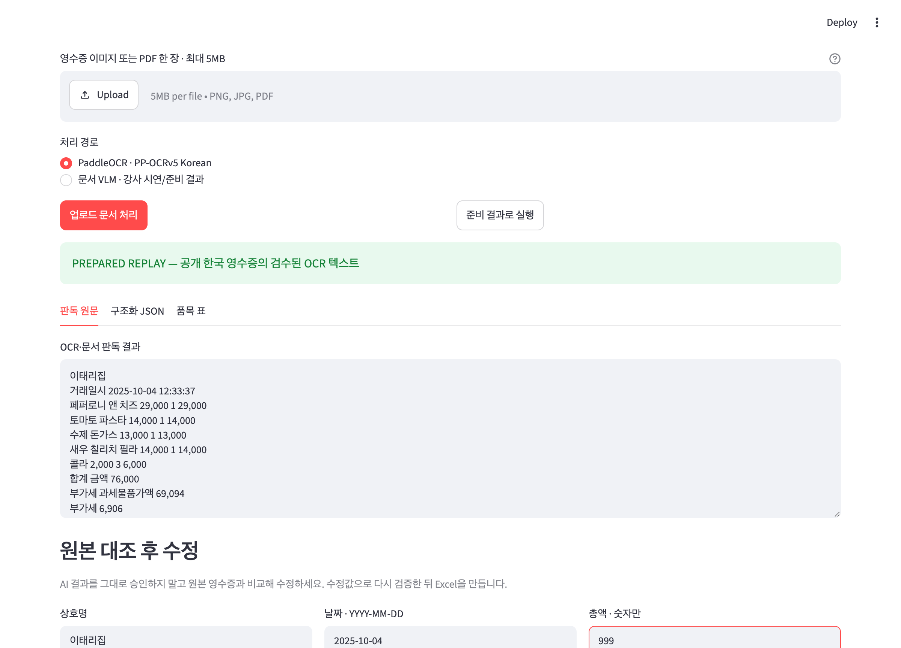
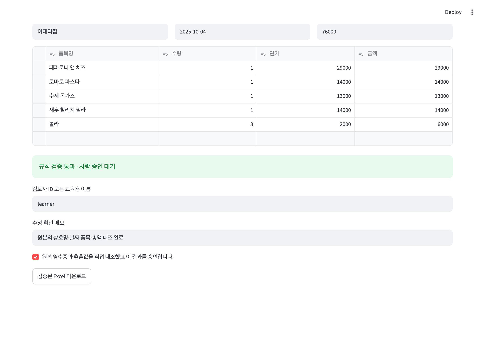

# 7교시. 추출 결과 검증 및 데이터 저장

OCR과 VLM이 읽은 값은 어디까지나 초안입니다. 합계가 틀리거나 날짜가 빠진 결과를 그대로 Excel에 저장하면 자동화가 오히려 새로운 업무 오류를 만들 수 있습니다.

이번 시간에는 프로그램의 규칙 검사와 사람의 원본 확인을 분리해 구현합니다. 잘못 읽은 값은 화면에서 수정하고, 다시 검사한 뒤, 승인된 결과만 Excel로 내려받습니다.

> **이번 시간의 도착점:** 오류 또는 미승인 결과의 저장을 차단하고, 수정·재검증·사람 승인을 마친 결과만 Excel로 저장합니다.

[7교시 Colab 실습 열기](https://colab.research.google.com/github/leecks1119/document_ai_lecture/blob/master/colab/07_validation_export.ipynb)

## 프로그램 검사와 사람 승인은 다릅니다

프로그램은 정해진 조건을 빠르게 확인할 수 있습니다.

- 상호명과 날짜가 비어 있지 않은가?
- 금액이 숫자로 저장되어 있는가?
- 수량과 단가를 곱한 값이 품목 금액과 같은가?
- 품목 금액의 합과 최종 결제 금액이 맞는가?
- 주요 값에 원본 근거가 있는가?

하지만 프로그램의 규칙을 모두 통과했다고 해서 원본과 같은 값이라는 뜻은 아닙니다. OCR이 상호명을 다른 글자로 읽었는데 그 결과가 빈 문자열이 아니라면 “필수값이 있다”는 검사는 통과할 수 있습니다.

따라서 검증 결과와 사람 승인을 별도로 관리합니다.

| 상태 | 의미 | 다음 행동 |
| --- | --- | --- |
| 정상 | 현재 규칙에서 차단할 오류를 찾지 못함 | 사람이 원본과 비교 |
| 경고 | 저장할 수는 있지만 확인이 필요한 항목이 있음 | 검토 내용을 기록 |
| 오류 | 계산이나 필수값 규칙을 위반함 | 값을 수정한 뒤 다시 검사 |
| 승인 대기 | 자동 검사가 끝났지만 사람이 확인하지 않음 | Excel 저장 금지 |
| 승인 완료 | 사람이 원본을 확인하고 결과를 확정함 | Excel 저장 가능 |


## 영수증에서 확인할 다섯 가지 규칙

### 1. 필수 항목

상호명, 거래 날짜, 품목, 합계처럼 업무에 꼭 필요한 값이 비어 있지 않아야 합니다.

### 2. 자료형

계산에 사용할 금액과 수량은 문자열이 아니라 숫자로 저장합니다. Python에서는 `True`와 `False`도 숫자처럼 취급될 수 있으므로 금액으로 허용하지 않습니다.

### 3. 품목 계산

각 품목에서 다음 계산이 맞는지 확인합니다.

```text
수량 × 단가 = 품목 금액
```

### 4. 전체 합계

영수증에는 할인, 세금, 봉사료, 반올림이 있을 수 있습니다. 따라서 단순히 품목 금액만 더하지 않고 영수증의 계산 방식을 반영해야 합니다.

이번 영수증의 부가세 `6,906원`은 품목 가격 `76,000원`에 이미 포함되어 있습니다.

```text
공급가액 69,094 + 포함 부가세 6,906 = 결제금액 76,000
품목 금액 합계 76,000 + 추가 조정 0 = 최종 합계 76,000
```

포함된 부가세를 다시 더하면 `82,906원`이라는 잘못된 결과가 됩니다. 숫자만 읽는 것보다 금액의 의미를 이해하는 것이 중요한 이유입니다.

### 5. 원본 근거

상호명, 날짜, 합계가 원본의 어느 문자열에서 왔는지 확인할 수 있어야 합니다. 잘못된 값을 수정했을 때는 누가, 언제, 왜 수정했는지도 남깁니다.

## Excel로 저장할 때 생기는 보안 문제

문서에서 읽은 문자열이 `=`, `+`, `-`, `@`로 시작하면 Excel이 수식으로 해석할 수 있습니다. 공백이나 탭 뒤에 이러한 문자가 숨어 있는 경우도 있습니다.

```python
value.lstrip(" \t\r\n").startswith(("=", "+", "-", "@"))
```

외부 문서에서 읽은 문자열은 수식으로 실행되지 않도록 텍스트로 보호해야 합니다. 이것은 단순한 파일 저장 문제가 아니라 입력 데이터가 Excel 기능을 실행하지 못하게 막는 보안 조치입니다.

## 직접 해보기

### 1. 4교시의 영수증 JSON을 불러옵니다

기본값 `USE_PREPARED_INPUT=True`는 새 Colab에서도 공개 영수증의 검수된
예제로 바로 실행됩니다. 4교시 결과를 이어서 검증하려면 값을 `False`로
바꾸고 `receipt.json`을 선택합니다.

원본 영수증 이미지와 JSON을 나란히 열어 둡니다.

### 2. 승인하지 않은 상태에서 저장을 시도합니다

먼저 사람의 승인 없이 Excel 저장 함수를 실행합니다. 자동 검사에서 오류가 없더라도 승인 상태가 `PENDING`이면 파일이 만들어지지 않아야 합니다.

이 단계가 중요한 이유는 사용자의 실수나 프로그램 오류로 검토되지 않은 데이터가 업무 파일에 섞이는 것을 막기 위해서입니다.

### 3. 원본과 항목을 하나씩 비교합니다

다음 순서로 확인하세요.

1. 상호명이 원본과 같은가?
2. 거래 날짜와 시간이 같은가?
3. 품목명, 수량, 단가, 금액이 같은 행에 연결되었는가?
4. 품목 금액의 합이 76,000원인가?
5. 합계의 원본 근거가 `합계 금액 76,000`인가?

노트북의 검토 기록에는 자신의 이름과 확인 내용을 적습니다. 코딩 문법보다 “누가 무엇을 보고 승인했는가”가 남는 것이 중요합니다.

### 4. 일부러 틀린 값을 만들고 고칩니다

최종 앱을 열고 합계를 `999`로 바꿔 보세요. 다시 검증하면 합계 오류가 나타나고 Excel 다운로드 버튼이 사라져야 합니다.



이제 원본을 보고 값을 `76000`으로 되돌립니다. 품목명, 수량, 단가, 금액도 표에서 수정할 수 있습니다. 수정이 끝나면 다시 검증하고 원본 대조 확인란을 선택한 뒤 승인합니다.

### 5. 승인된 Excel을 내려받습니다

승인이 완료되면 Excel 다운로드 버튼이 나타납니다.



생성된 `receipt_result.xlsx`에는 세 개의 시트가 있습니다.


- `검토_요약`: 원문값, AI가 정리한 값, 최종값, 승인자, 승인 시각, 수정 이유
- `품목`: 품목 하나당 한 행
- `원문_근거`: OCR 원문과 각 항목이 나온 근거

세 시트를 직접 열어 같은 합계 값이 어떤 정보와 함께 저장되어 있는지 확인합니다.

## 실습 결과

이번 교시에서는 다음 결과를 완성합니다.

- `receipt_result.xlsx`: 사람이 확인하고 승인한 영수증 결과
- `final_document_ai_app.zip`: 값 수정, 재검증, 승인, Excel 다운로드 기능을 포함한 앱

실습을 마친 뒤 다음 질문에 답할 수 있는지 확인하세요.

1. 자동 검사를 통과한 결과도 사람 확인이 필요한 이유는 무엇인가요?
2. 포함된 부가세를 다시 더하면 왜 잘못된 결과가 되나요?
3. 잘못된 합계를 입력했을 때 다운로드가 차단되어야 하는 이유는 무엇인가요?
4. 승인자와 수정 이유를 기록하면 실제 업무에 어떤 도움이 되나요?

다음 교시에는 영수증에서 익힌 흐름을 견적서, 신청서, 거래명세서에 적용하고 우리 업무의 첫 PoC 후보를 고릅니다.

## 잘되지 않을 때

- 합계 오류가 나오면 각 품목의 수량, 단가, 금액을 먼저 비교합니다.
- 영수증에 할인이나 세금이 있으면 이미 포함된 금액인지 별도로 더할 금액인지 확인합니다.
- Excel 파일이 열려 있어 저장할 수 없다는 오류가 나오면 파일을 닫고 다시 실행합니다.
- 오류가 남아 있는데 승인 상태만 바꾸어 저장하지 않습니다.

## 참고자료

검증, 사람 검토, Excel 저장 보안에 관한 공식 근거는 [과정 참고자료의 7교시 항목](../docs/course_references.md)에서 확인할 수 있습니다.
