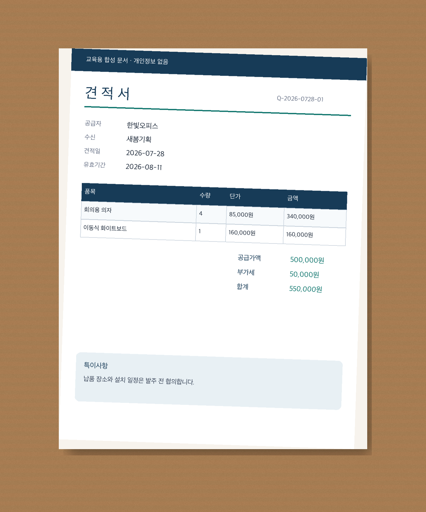
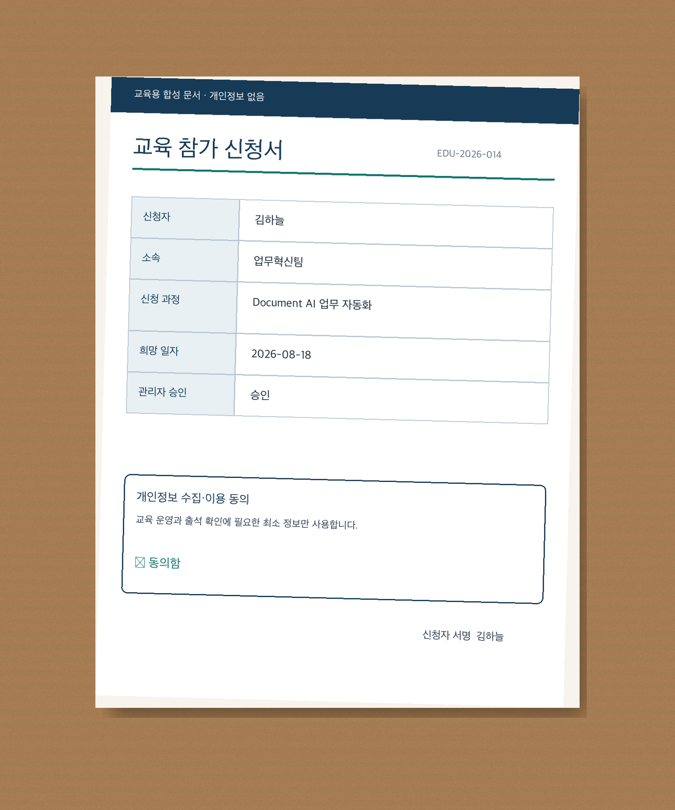
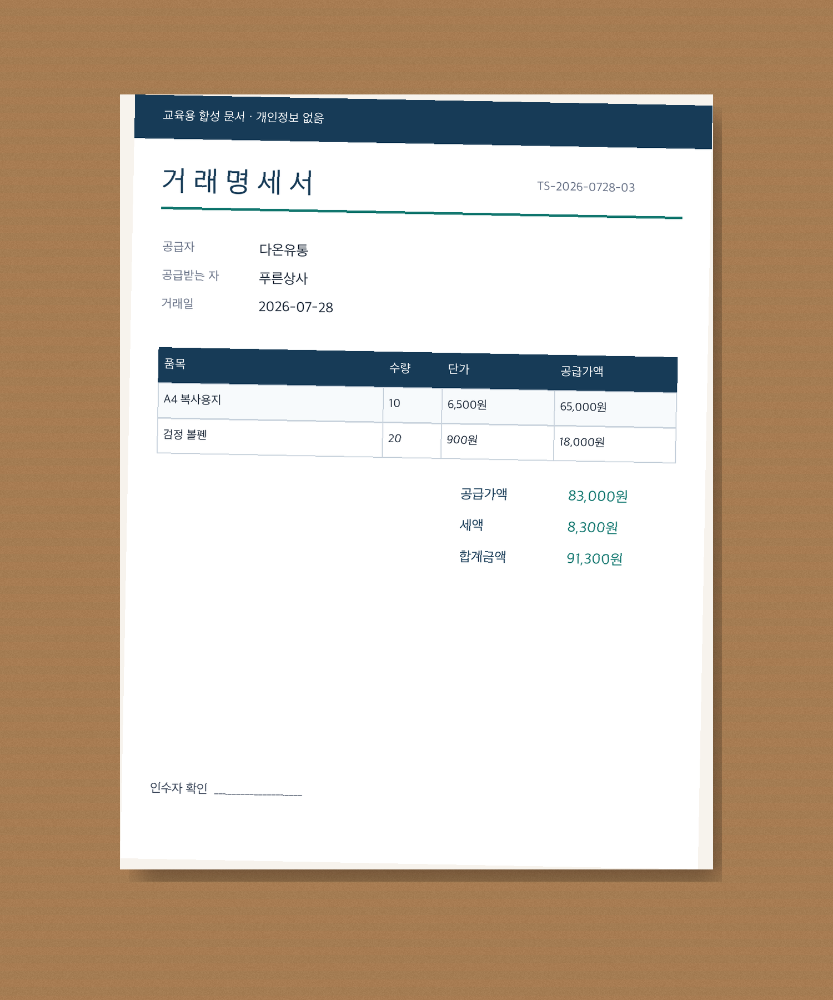
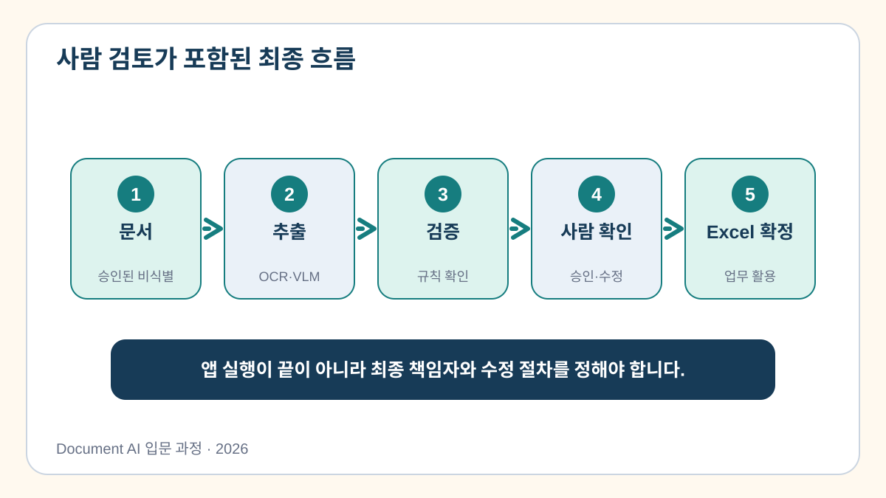
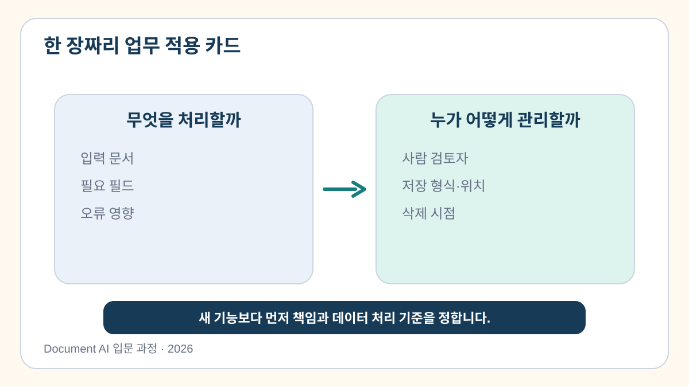

# 8교시. 실무 적용 시나리오 설계 및 최종 정리

영수증 프로토타입을 완성했다면 다음 질문은 “우리 회사에서는 어떤 문서로 시작할 것인가?”입니다. 문서 자동화의 기본 흐름은 재사용할 수 있지만, 찾아야 할 항목과 검증 규칙, 오류가 업무에 미치는 영향은 문서마다 다릅니다.

마지막 시간에는 견적서, 신청서, 거래명세서를 직접 살펴보고 첫 번째 PoC로 시험할 문서 한 가지를 선택합니다.

[8교시 Colab 실습 열기](https://colab.research.google.com/github/leecks1119/document_ai_lecture/blob/document_ai_lecture_2026/colab/08_business_application.ipynb)

## 세 가지 업무 문서를 비교해 봅시다

아래 문서는 실제 문서와 비슷한 형태로 제작한 교육용 합성 샘플입니다. 실제 개인정보나 거래정보는 들어 있지 않습니다.

### 견적서



견적서에서는 문서번호, 공급자, 수신자, 견적일, 품목, 공급가액, 부가세, 총액을 찾을 수 있습니다.

주요 검증 규칙은 `수량 × 단가 = 품목 금액`, `공급가액 + 부가세 = 총액`입니다. 금액이 잘못 추출되면 구매 결정이나 예산 검토에 영향을 줄 수 있습니다.

### 신청서



신청서에서는 신청번호, 신청자, 소속, 신청 과정, 동의 여부, 관리자 승인을 확인합니다.

금액 계산보다 필수 항목과 동의·승인 상태가 중요합니다. 이름이나 소속처럼 개인정보가 포함될 가능성이 높으므로 외부 AI 서비스에 전송할 수 있는지 먼저 확인해야 합니다.

### 거래명세서



거래명세서에서는 문서번호, 공급자, 거래일, 품목, 공급가액, 세액, 총액을 추출합니다.

품목 행과 세금 계산이 맞아야 하며, 오류가 발생하면 정산과 회계 처리에 영향을 줄 수 있습니다.

## 파일 형식에 따라 출발점이 달라집니다

문서의 내용이 같아도 Excel, Word, PDF, PowerPoint, 화면 캡처는 서로 다른 정보를 가지고 있습니다.

| 형식 | 파일 안에 남아 있는 구조 | 확인할 예외 |
| --- | --- | --- |
| Excel | 셀, 수식, 시트 | 병합 셀, 숨김 시트, 숫자 서식 |
| Word | 문단, 표, 그림 | 머리글, 텍스트 상자, 변경 추적, 이미지 본문 |
| PDF | 페이지와 선택 가능한 텍스트 | 스캔 페이지, 암호, 깨진 문자 정보 |
| PowerPoint | 도형, 표, 이미지 | 그룹 도형, 읽기 순서, 발표자 노트 |
| 표 캡처 | 픽셀만 남음 | 행·열·병합 셀 관계를 다시 찾아야 함 |

같은 “문서”라고 해서 모두 OCR로 시작하지 않습니다. Excel에 셀과 수식이 남아 있다면 직접 읽는 편이 더 정확합니다. Word 안에 신청서 사진만 들어 있다면 이미지를 꺼내 OCR이나 VLM을 적용해야 합니다. PDF에서는 먼저 글자를 마우스로 선택할 수 있는지 확인합니다.

실습에서는 다음 파일을 직접 열어 차이를 확인합니다.

- [견적서 Excel](../sample_docs/formats/quotation.xlsx)
- [이미지 기반 신청서 Word](../sample_docs/formats/application_form.docx)
- [텍스트를 선택할 수 있는 거래명세서 PDF](../sample_docs/formats/transaction_statement.pdf)
- [표 캡처를 설명하는 PowerPoint](../sample_docs/formats/table_summary.pptx)

## 영수증에서 배운 흐름을 옮겨 봅시다

문서의 종류가 달라져도 다음 질문은 그대로 사용할 수 있습니다.

```text
어떤 문서를 받을 것인가?
  → 어떤 방식으로 읽을 것인가?
  → 어떤 항목을 추출할 것인가?
  → 무엇을 규칙으로 검사할 것인가?
  → 오류가 나면 누가 확인할 것인가?
  → 승인된 결과를 어디에 저장할 것인가?
```



예를 들어 견적서를 선택한다면 다음과 같이 설계할 수 있습니다.

| 질문 | 견적서 PoC 예 |
| --- | --- |
| 입력 | 같은 양식의 비식별 견적서 사진 한 장 |
| 추출 항목 | 공급자, 견적일, 품목, 수량, 단가, 공급가액, 부가세, 총액 |
| 검증 규칙 | 수량×단가, 품목 합계, 공급가액+부가세 |
| 오류 처리 | 금액 불일치 문서는 구매 담당자가 원본 확인 |
| 결과 | 승인된 값만 Excel로 다운로드 |

## 첫 번째 PoC 후보를 고르는 기준

처음부터 가장 어렵고 중요한 문서를 선택할 필요는 없습니다. 작은 PoC는 반복해서 들어오고, 형식이 비교적 일정하며, 사람이 결과를 확인할 수 있는 문서가 적합합니다.

다음 항목을 1점에서 5점으로 평가합니다.

| 항목 | 1점에 가까운 경우 | 5점에 가까운 경우 |
| --- | --- | --- |
| 반복량 | 가끔 한 번 들어옴 | 같은 문서가 자주 들어옴 |
| 항목의 일관성 | 매번 필요한 항목이 다름 | 필요한 항목이 거의 같음 |
| 오류 영향과 복구 | 한 번의 오류가 큰 사고로 이어짐 | 사람이 확인하면 쉽게 복구 가능 |
| 예외 빈도 | 예외가 자주 발생함 | 예외가 드물고 비슷한 양식이 반복됨 |
| 사람 검토 가능성 | 원본 확인 담당자가 없음 | 담당자가 결과를 확인할 수 있음 |

점수가 높다고 바로 자동화하지는 않습니다. 개인정보, 보안, 데이터 보존 정책을 먼저 확인하고, 오류가 발생했을 때 저장을 중단할 수 있어야 합니다.

## 직접 해보기: 나의 PoC 카드 만들기

견적서, 신청서, 거래명세서 가운데 자신의 업무와 가장 가까운 문서 한 가지를 선택합니다. 수강생마다 한 가지 문제를 정해 다음 내용을 작성합니다.

1. 이 문서를 누가, 얼마나 자주 처리하나요?
2. 한 장에서 반드시 추출할 항목은 무엇인가요?
3. 자동으로 검사할 수 있는 규칙은 무엇인가요?
4. 어떤 오류가 가장 위험한가요?
5. 결과를 확인하고 승인할 사람은 누구인가요?
6. 승인된 결과는 어떤 Excel 열로 저장할까요?
7. 어떤 상황이 발생하면 PoC를 중단해야 하나요?

노트북에서 각 항목과 점수를 채우면 `course_outputs/poc_candidate_card.md`가 만들어집니다.



## PoC는 작게 검증합니다

첫 시험에서는 문서 종류와 처리 범위를 넓히지 않습니다.

- 같은 종류와 비슷한 양식의 문서 약 30장을 준비합니다.
- 사람이 미리 확인한 정답표와 추출 결과를 비교합니다.
- 전체 정확도 하나가 아니라 항목별 정확도와 수정 횟수를 기록합니다.
- 한 장을 처리하는 시간과 사람이 검토하는 시간을 함께 측정합니다.
- 오류가 있는 결과는 자동 저장하지 않고 검토 대상으로 보냅니다.
- 성능이 낮다면 모델뿐 아니라 촬영 품질, 항목 정의, 검증 규칙도 함께 살펴봅니다.

30장은 운영 도입을 결정하는 절대 기준이 아니라 첫 문제를 발견하기 위한 작은 출발점입니다. 문서의 위험도와 다양성에 따라 더 많은 검증 자료가 필요할 수 있습니다.

## 과정을 마치며

오늘 만든 프로토타입의 핵심은 AI 모델 하나가 아닙니다.

```text
문서 한 장
  → 글자와 구조 읽기
  → 필요한 항목 추출
  → 원본 근거와 계산 확인
  → 사람이 오류 수정
  → 승인된 값만 Excel로 저장
```

이제 다음 질문에 자신의 업무를 넣어 답해 보세요.

> “영수증 대신 우리 회사의 견적서나 신청서를 넣는다면, 어떤 항목과 검증 규칙을 바꾸어야 할까?”

그 질문에 구체적으로 답하고 작은 샘플로 시험할 수 있다면, 실제 Document AI PoC를 시작할 준비가 된 것입니다.

## 실습 결과

마지막 교시에서는 다음 자료를 가져갑니다.

- 자신의 판단이 담긴 `poc_candidate_card.md`
- Excel, Word, PDF, PowerPoint 체험 파일이 들어 있는 `office_format_samples.zip`
- 견적서·신청서·거래명세서의 Python 검증 코드와 JSON 예제가 들어 있는
  `business_document_code_examples.zip`
- 값 수정, 검증, 승인, Excel 다운로드가 가능한 최종 프로토타입

## 참고자료

PoC 설계와 문서 형식별 처리 방식의 공식 근거는 [과정 참고자료의 8교시 항목](../docs/course_references.md)에서 확인할 수 있습니다.
