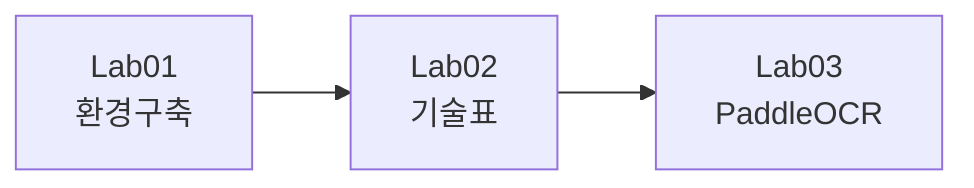
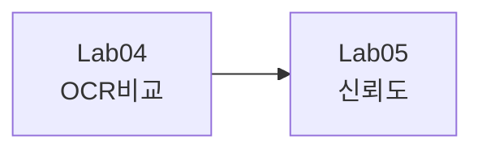
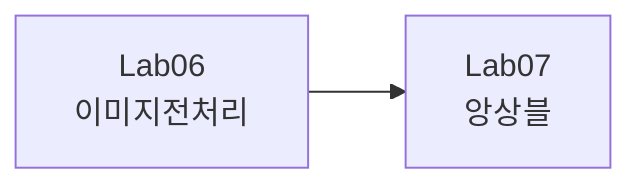
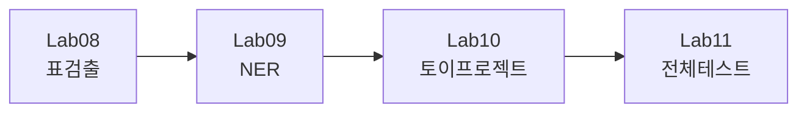

# Document AI 실습 노트북 모음

[](https://github.com/leecks1119/document_ai_lecture)

## 🚀 바로 시작하기

### Google Colab에서 노트북 열기

**방법 1: Colab 배지 클릭 (가장 쉬움!)**

각 노트북 상단의 "Open in Colab" 배지를 클릭하면 바로 열립니다!

**방법 2: 직접 URL 입력**

```
https://colab.research.google.com/github/leecks1119/document_ai_lecture/blob/main/notebooks/[노트북파일명].ipynb
```

예시:
- Lab01: `https://colab.research.google.com/github/leecks1119/document_ai_lecture/blob/main/notebooks/Lab01_개발환경구축.ipynb`
- Lab04: `https://colab.research.google.com/github/leecks1119/document_ai_lecture/blob/main/notebooks/Lab04_OCR엔진비교.ipynb`

---

## 📚 실습 목록

| 번호 | 실습명 | Colab 링크 | 난이도 | 시간 |
|------|--------|-----------|--------|------|
| 01 | 개발환경 구축 | [](https://colab.research.google.com/github/leecks1119/document_ai_lecture/blob/main/notebooks/Lab01_개발환경구축.ipynb) | ⭐ | 10분 |
| 02 | Document AI 기술표 | [](https://colab.research.google.com/github/leecks1119/document_ai_lecture/blob/main/notebooks/Lab02_기술표.ipynb) | ⭐ | 15분 |
| 03 | PaddleOCR 기본 사용 | [](https://colab.research.google.com/github/leecks1119/document_ai_lecture/blob/main/notebooks/Lab03_PaddleOCR.ipynb) | ⭐⭐ | 20분 |
| 04 | OCR 엔진 비교 | [](https://colab.research.google.com/github/leecks1119/document_ai_lecture/blob/main/notebooks/Lab04_OCR엔진비교.ipynb) | ⭐⭐⭐ | 30분 |
| 05 | 신뢰도 측정 | [](https://colab.research.google.com/github/leecks1119/document_ai_lecture/blob/main/notebooks/Lab05_신뢰도측정.ipynb) | ⭐⭐⭐ | 25분 |
| 06 | 이미지 전처리 | [](https://colab.research.google.com/github/leecks1119/document_ai_lecture/blob/main/notebooks/Lab06_이미지전처리.ipynb) | ⭐⭐⭐⭐ | 40분 |
| 07 | OCR 앙상블 | [](https://colab.research.google.com/github/leecks1119/document_ai_lecture/blob/main/notebooks/Lab07_앙상블.ipynb) | ⭐⭐⭐⭐ | 35분 |
| 08 | 표 검출 | [](https://colab.research.google.com/github/leecks1119/document_ai_lecture/blob/main/notebooks/Lab08_표검출.ipynb) | ⭐⭐⭐⭐ | 40분 |
| 09 | NER 정보 추출 | [](https://colab.research.google.com/github/leecks1119/document_ai_lecture/blob/main/notebooks/Lab09_NER정보추출.ipynb) | ⭐⭐⭐ | 30분 |
| 10 | Cursor AI 프로젝트 | [](https://colab.research.google.com/github/leecks1119/document_ai_lecture/blob/main/notebooks/Lab10_토이프로젝트.ipynb) | ⭐⭐⭐⭐⭐ | 60분 |
| 11 | 전체 시스템 테스트 | [](https://colab.research.google.com/github/leecks1119/document_ai_lecture/blob/main/notebooks/Lab11_전체테스트.ipynb) | ⭐⭐⭐⭐ | 40분 |

---

## 📖 상세 가이드

### 🎯 강의 들을 때 사용 방법

#### 1단계: Colab 배지 클릭
각 노트북 상단의 파란색 "Open in Colab" 배지를 클릭합니다.

#### 2단계: GPU 설정 (권장)
```
런타임 → 런타임 유형 변경 → 하드웨어 가속기: GPU 선택 → 저장
```

#### 3단계: 셀 실행
- 단축키: `Shift + Enter` - 현재 셀 실행 후 다음 셀로
- 단축키: `Ctrl + Enter` - 현재 셀만 실행
- 또는 각 셀 왼쪽의 ▶️ 버튼 클릭

#### 4단계: 순서대로 실행
**중요!** 노트북은 위에서 아래로 순서대로 실행해야 합니다.

---

## 💾 결과 저장하기 (선택사항)

### Google Drive 마운트

결과를 저장하고 싶다면 노트북에 다음 코드를 추가하세요:

```python
from google.colab import drive
drive.mount('/content/drive')

# 작업 디렉토리 설정
import os
SAVE_DIR = '/content/drive/MyDrive/DocumentAI_Results'
os.makedirs(SAVE_DIR, exist_ok=True)
os.chdir(SAVE_DIR)

print(f"✅ 결과 저장 경로: {SAVE_DIR}")
```

**언제 필요한가요?**
- ✅ 여러 날에 걸쳐 작업할 때
- ✅ 결과를 계속 보관하고 싶을 때
- ❌ 한 번에 끝나는 짧은 실습은 불필요

---

## 🔧 문제 해결

### Q1: 패키지 설치 오류
```python
!pip cache purge
!pip install --no-cache-dir git+https://github.com/leecks1119/document_ai_lecture.git
```

### Q2: GPU 메모리 부족
```
런타임 → 런타임 다시 시작
```

### Q3: 한글 깨짐
```python
!apt-get install -y fonts-nanum
!fc-cache -fv
import matplotlib.pyplot as plt
plt.rcParams['font.family'] = 'NanumGothic'
```

### Q4: 세션이 종료됨
- Colab 무료 버전은 12시간 제한, 90분 무활동 시 종료됩니다.
- 중요한 결과는 Drive에 저장하거나 다운로드하세요.

---

## 🎓 실습 순서

### 기초 (1-3)


### OCR 실습 (4-5)


### 전처리 (6-7)


### 고급 (8-11)


---

## 📞 문의 및 지원

- **GitHub**: https://github.com/leecks1119/document_ai_lecture
- **Issues**: 문제 발생 시 GitHub Issues에 등록

---

## 🔗 관련 링크

- [강의 슬라이드](../README.md)
- [패키지 문서](../README.md#-빠른-시작)
- [Notion 강의 자료](https://www.notion.so/Document-AI-281707c7ae7581beb748feca63ac4e16)

---

**Happy Learning! 🚀**

